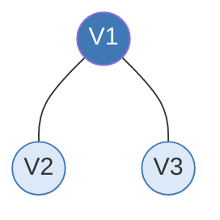
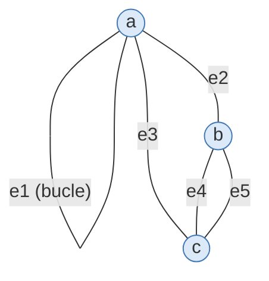
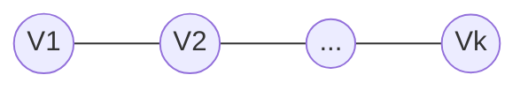
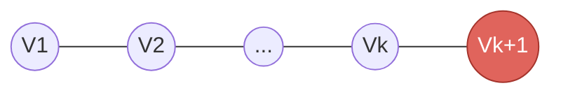
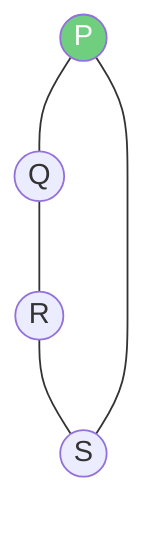
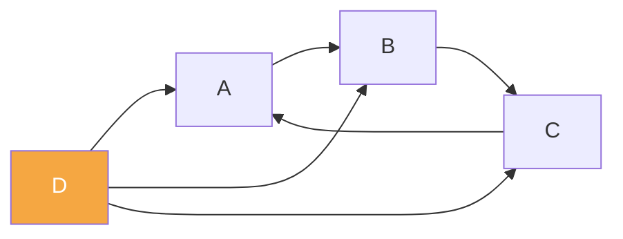
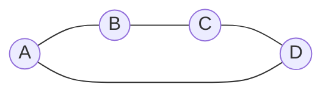
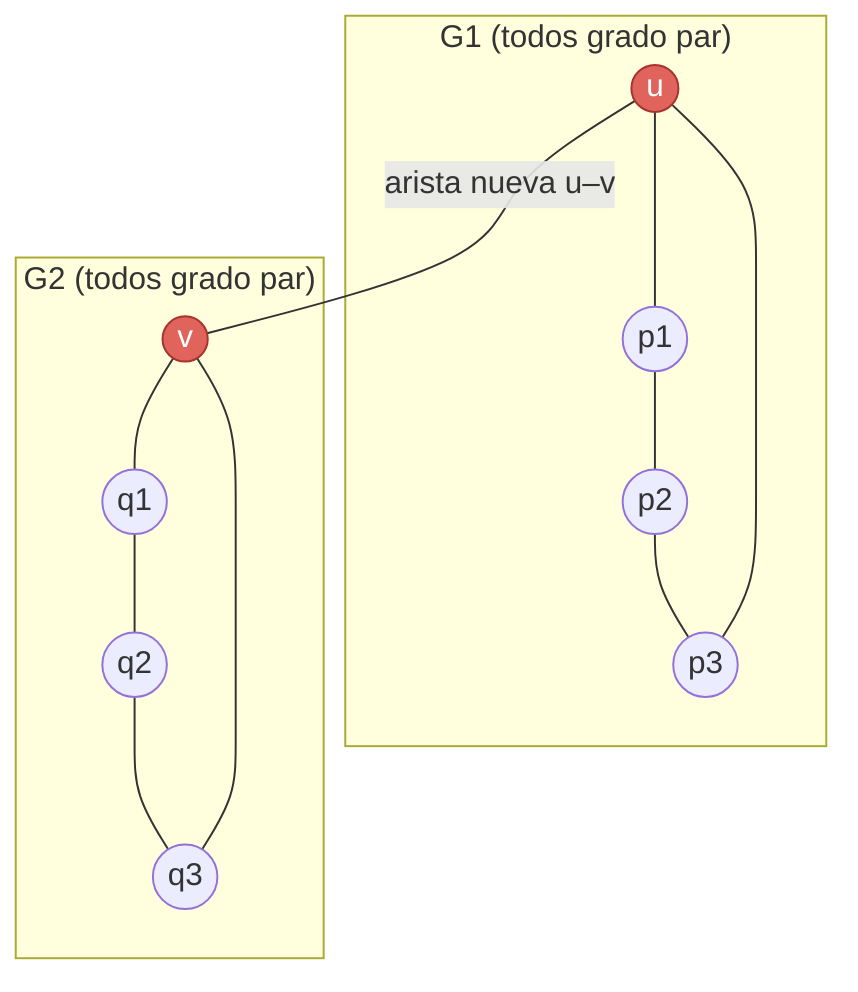

# Fundamentos de grafos — Guía a detalle

> Este documento cubre **solo los fundamentos** de teoría de grafos (nada de
> algoritmos como Floyd-Warshall, Dijkstra, Prim, etc. — eso queda para
> cuando lo pidas). Cada tema trae su explicación completa, el problema
> resuelto y un gráfico real en Mermaid.

---

## 1. Definición de grafo

Un grafo es una estructura $G = (V, E)$ formada por dos conjuntos:

- $V = \{V_1, V_2, \dots, V_n\}$: el conjunto de **vértices** (o nodos).
- $E = \{e_1, e_2, \dots, e_n\}$: el conjunto de **aristas**, que son las
  conexiones entre los vértices.

Una arista no es más que un par de vértices (a veces el mismo vértice dos
veces, lo que se llama **bucle**). El grafo, en el fondo, es solo una forma
de modelar relaciones: quién está conectado con quién.

---

## 2. Grado de un vértice

**Definición:** el grado de un vértice $\delta(v)$ en una gráfica **no
dirigida** es la cantidad de aristas que llegan o salen de él (aristas
*incidentes*).

### Problema

Dado el siguiente grafo, calcula el grado de cada vértice:



### Resolución

$V_1$ tiene dos aristas tocándolo (una hacia $V_2$, otra hacia $V_3$), así
que $\delta(V_1)=2$. $V_2$ y $V_3$ solo tienen una arista cada uno:

$$\delta(V_1) = 2, \qquad \delta(V_2) = 1, \qquad \delta(V_3) = 1$$

**Detalle importante — bucles:** si una arista sale y regresa al **mismo**
vértice (un bucle o lazo), esa arista cuenta **doble** para el grado de ese
vértice, porque técnicamente "entra y sale" de él. Esto se ve más abajo en
la sección de matrices.

---

## 3. Ciclo de Euler vs. ciclo de Hamilton

Ambos son recorridos cerrados (empiezan y terminan en el mismo vértice),
pero se enfocan en cosas distintas:

| | Ciclo de Euler | Ciclo de Hamilton |
|---|---|---|
| Recorre | **Todas las aristas** exactamente una vez | **Todos los vértices** exactamente una vez |
| Repetición de vértices | Sí puede repetir vértices | No puede repetir (salvo el inicial al cerrar) |
| Inicio/fin | Mismo vértice | Mismo vértice |
| Se enfoca en | Aristas | Vértices |
| Condición de existencia | Grafo conexo y **todos** los vértices de grado par | No hay criterio simple — decidirlo es **NP-completo** |
| Bucles | Cada bucle cuenta como **2** en el grado | — |

**Por qué la asimetría:** para Euler basta con revisar los grados de los
vértices (rapidísimo). Para Hamilton no existe un atajo así — hay que
probar combinaciones, y en el peor caso eso crece exponencialmente. Por
eso hay un algoritmo directo y eficiente para construir un circuito de
Euler (ver sección 7), pero no lo hay para Hamilton.

---

## 4. Matriz de adyacencia y matriz de incidencia

- **Matriz de adyacencia:** cuenta cuántas aristas conectan *directamente*
  cada par de vértices. Es una tabla vértice × vértice.
- **Matriz de incidencia:** marca si un vértice es *extremo* de una arista
  específica. Es una tabla vértice × arista.

### Problema

Grafo con vértices $\{a,b,c\}$ y 5 aristas, una de ellas un **bucle en
$a$**:



### Resolución

**Matriz de adyacencia:**

| | a | b | c |
|---|---|---|---|
| a | 2 | 1 | 1 |
| b | 1 | 0 | 2 |
| c | 1 | 2 | 0 |

**Matriz de incidencia:**

| | e1 | e2 | e3 | e4 | e5 |
|---|---|---|---|---|---|
| a | 2 | 1 | 1 | 0 | 0 |
| b | 0 | 1 | 0 | 1 | 1 |
| c | 0 | 0 | 1 | 1 | 1 |

**Cómo leerlas:** en la adyacencia, la diagonal de $a$ vale $2$ porque el
bucle cuenta doble. Fuera de la diagonal, $a$-$b=1$ (una arista directa),
$b$-$c=2$ (dos aristas paralelas entre $b$ y $c$). En la incidencia, la
columna $e_1$ (el bucle) tiene un **2** únicamente en la fila de $a$ —
así es como se representa un bucle: no toca a ningún otro vértice, pero
"pesa doble" en el suyo.

> **Nota:** en el material fuente, la tabla de incidencia venía dibujada
> de forma inconsistente con la de adyacencia (mostraba el bucle como una
> arista normal $a$–$b$). Aquí ya quedó corregida para que ambas coincidan:
> $e_1$ es el bucle, $e_2$ es $a$–$b$, $e_3$ es $a$–$c$, y $e_4,e_5$ son las
> dos aristas paralelas $b$–$c$.

---

## 5. Teorema del apretón de manos

**Enunciado:** la suma de los grados de todos los vértices de una gráfica
es igual al doble del número de aristas.

$$\sum_{v \in V} \delta(v) = 2|E|$$

### Demostración por inducción sobre el número de nodos

Esta es una forma distinta (y muy elegante) de demostrarlo: en vez de
razonar sobre pares/impares, se demuestra **construyendo el grafo nodo por
nodo**.

**Caso base ($n = k$ nodos):** imagina una cadena simple de $k$ vértices:



Si esta cadena tiene $e_r$ aristas en total, por construcción se cumple:

$$\sum_{i=1}^{k} \delta(V_i) = 2e_r$$

**Paso inductivo ($n = k+1$ nodos):** ahora agregamos un nuevo vértice
$V_{k+1}$, conectado al final de la cadena:



Esa **única arista nueva** aporta exactamente **+2** a la suma total:
+1 al grado de $V_k$ (donde se conecta) y +1 al grado de $V_{k+1}$ (el
nodo nuevo). Entonces:

$$\sum_{i=1}^{k+1} \delta(V_i) = \sum_{i=1}^{k} \delta(V_i) + \delta(V_{k+1}) = 2e_r + 2 = 2(e_r+1) = 2e_{r+1}$$

Como el patrón se mantiene sin importar cuántos nodos se agreguen uno por
uno (hipótesis inductiva), el teorema queda demostrado para cualquier $n$:

$$\sum_{i=1}^{k} \delta(V_i) = 2e_r \qquad \blacksquare$$

**Por qué funciona esta lógica:** cada arista nueva que se agrega tiene
exactamente dos extremos, así que **siempre** suma +2 al total sin
importar en qué momento del proceso de construcción se agregue. Por eso la
suma de grados nunca puede ser impar.

### Corolario: el número de vértices de grado impar es par

Esta es la consecuencia más usada del teorema:

1. Separa $V$ en $V_{par}$ (grado par) y $V_{impar}$ (grado impar).
2. $\displaystyle\sum_{v \in V_{par}} \delta(v) + \sum_{v \in V_{impar}} \delta(v) = 2|E|$
3. La suma de los grados pares ya es par, y $2|E|$ también es par. Al
   restar un número par de otro número par, el resultado sigue siendo
   par:
   $$\sum_{v \in V_{impar}} \delta(v) = 2|E| - \sum_{v \in V_{par}} \delta(v) \quad \text{(par)}$$
4. Pero una suma de números **impares** solo da un resultado **par** si la
   **cantidad** de sumandos es par (impar + impar = par; un número impar
   de impares siempre da impar).
5. Por lo tanto, $|V_{impar}|$ (la cantidad de vértices de grado impar)
   debe ser par. $\blacksquare$

---

## 6. Pseudocódigo de un circuito de Euler

**Problema real:** un distrito tiene camiones recolectores de basura que
deben recorrer un circuito de Euler (pasar por cada calle/arista
exactamente una vez y volver al punto de partida).

```
PROCEDIMIENTO Euler(vértice, Grafo)
  PARA cada arista (vértice, nodo_adyacente) en Grafo HACER
    SI (vértice, nodo_adyacente) NO está visitada ENTONCES
      marcar (vértice, nodo_adyacente) como visitada
      Euler(nodo_adyacente, Grafo)
    FIN SI
  FIN PARA
  imprimir vértice
FIN PROCEDIMIENTO
```

### Trazado con un ejemplo concreto

Un distrito muy simple, en forma de manzana (4 esquinas, cada una de
grado 2 — todas pares, así que sí tiene circuito de Euler):



Llamando a `Euler(P, Grafo)`, y asumiendo que desde cada vértice se
recorren los vecinos en el orden en que aparecen (P revisa primero a Q,
luego a S):

1. `Euler(P)` → arista P–Q no visitada → marcar → `Euler(Q)`
2. `Euler(Q)` → arista Q–R no visitada → marcar → `Euler(R)`
3. `Euler(R)` → arista R–S no visitada → marcar → `Euler(S)`
4. `Euler(S)` → arista S–P no visitada → marcar → `Euler(P)`
5. `Euler(P)` (segunda vez) → ya no quedan aristas sin visitar → **imprime P**
6. Vuelve a `Euler(S)` → ya no quedan aristas → **imprime S**
7. Vuelve a `Euler(R)` → ya no quedan aristas → **imprime R**
8. Vuelve a `Euler(Q)` → ya no quedan aristas → **imprime Q**
9. Vuelve a `Euler(P)` (llamada original) → la arista P–S ya está
   visitada → no quedan aristas → **imprime P**

**Secuencia impresa:** `P, S, R, Q, P`. Como el procedimiento imprime cada
vértice *después* de haber agotado sus llamadas recursivas (es un
recorrido en post-orden), la secuencia impresa queda en el **orden
inverso** al recorrido real. Leyéndola al revés se obtiene el circuito
real: $P \to Q \to R \to S \to P$ — exactamente el camino que debería
seguir el camión recolector.

---

## 7. Recorridos: caminos entre nodos

Aquí conviene distinguir dos representaciones distintas que aparecen
juntas en el material y que **no son el mismo grafo** — vale la pena
separarlas con claridad.

### 7.1 Matriz de adyacencia dirigida

$$M[i][j] = \begin{cases} 1 & \text{si hay una flecha } i \to j \\ 0 & \text{si no hay} \end{cases}$$

| | A | B | C | D |
|---|---|---|---|---|
| A | 0 | 1 | 0 | 0 |
| B | 0 | 0 | 1 | 0 |
| C | 1 | 0 | 0 | 0 |
| D | 1 | 1 | 1 | 0 |



Aquí $A,B,C$ forman un ciclo dirigido cerrado, y $D$ es una especie de
"nodo fuente": apunta hacia los otros tres pero nadie apunta hacia él.

### 7.2 Grafo no dirigido para buscar caminos (backtracking)

El algoritmo de búsqueda de caminos usa una lista de adyacencia distinta,
que forma un ciclo simple no dirigido de 4 nodos:

```
Grafo[A] = {B, D}
Grafo[B] = {A, C}
Grafo[C] = {B, D}
Grafo[D] = {A, C}
```



```
PROCEDIMIENTO EncontrarCaminos(origen, destino, Grafo, visitado, camino)
  agregar origen a camino
  marcar origen como visitado

  SI origen == destino ENTONCES
    imprimir camino
  SINO
    PARA cada vecino en Grafo[origen] HACER
      SI vecino NO está visitado ENTONCES
        EncontrarCaminos(vecino, destino, Grafo, visitado, camino)
      FIN SI
    FIN PARA
  FIN SI

  eliminar último elemento de camino
  desmarcar origen como visitado
FIN PROCEDIMIENTO
```

Es un **backtracking** clásico: agrega el nodo actual al camino, prueba
cada vecino no visitado, y si una rama no llega al destino, **deshace**
el último paso (`eliminar` + `desmarcar`) para probar otra rama. A
diferencia de un simple BFS/DFS, esto encuentra **todos** los caminos
simples posibles, no solo el primero que encuentra.

**Trazado:** buscando todos los caminos de $A$ a $C$ en el grafo de
arriba:

- Rama 1: $A \to B \to C$ ✅ (se imprime, porque llegó al destino)
- Vuelve atrás, prueba la otra rama desde $A$: $A \to D \to C$ ✅ (también
  llega)

**Resultado:** existen exactamente **2 caminos simples** entre $A$ y $C$:
$A{-}B{-}C$ y $A{-}D{-}C$ — tiene sentido, porque $A,B,C,D$ forman un
ciclo, y desde cualquier nodo hay exactamente dos formas de rodear el
ciclo hasta llegar al opuesto.

---

## 8. Demostración: unión de dos grafos de grado par no genera circuito de Euler

**Enunciado:** si $G_1$ y $G_2$ tienen todos sus vértices de grado par, y
se conectan mediante **una sola arista** entre un vértice $u \in G_1$ y un
vértice $v \in G_2$, el grafo resultante **no** tiene circuito de Euler.



### Demostración

1. Antes de unir: $\delta(u)$ y $\delta(v)$ son pares (por hipótesis).
2. Al agregar la arista $u$–$v$, **ambos** grados aumentan en 1:
   $$\delta(u) = \text{par}+1 = \text{impar}, \qquad \delta(v) = \text{par}+1 = \text{impar}$$
3. El resto de los vértices no se ven afectados — siguen con grado par.
4. Resultado: el grafo unido tiene **exactamente 2 vértices de grado
   impar** ($u$ y $v$, resaltados en rojo).
5. Como la condición necesaria para un circuito de Euler es que **todos**
   los vértices tengan grado par, el grafo resultante no puede tener
   circuito de Euler. $\blacksquare$

**Nota:** con exactamente 2 vértices de grado impar sí existe un **camino**
de Euler entre $u$ y $v$ (uno abierto, que no regresa al inicio) — pero
nunca un **circuito** (cerrado).

---

## 9. Demostración: condición suficiente para que exista un circuito de Euler

**Hipótesis:** $G=(V,E)$ es conexo, tiene más de un vértice, y **todo**
vértice tiene grado par.

**Objetivo:** demostrar que $G$ tiene un circuito de Euler.

### Paso 1 — Existe al menos un ciclo simple

Partiendo de cualquier vértice $v_0$ y caminando por aristas no usadas:
como todo vértice tiene grado par, **siempre** habrá una arista de salida
disponible cada vez que se entra a un vértice distinto de $v_0$ (se
"gasta" una arista al entrar, pero como el grado es par, siempre queda
otra para salir). El único lugar donde el recorrido puede "atascarse" es
de vuelta en $v_0$. Esto garantiza un ciclo cerrado $C_1$.

### Paso 2 — Si $C_1$ no cubre todas las aristas

Se eliminan las aristas de $C_1$ de $G$, obteniendo $G'$. Quitar un ciclo
resta exactamente 2 al grado de cada vértice que atraviesa (uno por
entrar, uno por salir), así que **todos los vértices de $G'$ siguen
teniendo grado par**.

### Paso 3 — Conexión de subciclos (inducción)

Como $G$ era conexo, $G'$ comparte al menos un vértice $u$ con $C_1$.
Repitiendo el Paso 1 desde $u$ dentro de $G'$, se obtiene un nuevo ciclo
$C_2$.

### Paso 4 — Fusión

Se recorre $C_1$ hasta llegar a $u$, ahí se inserta el recorrido completo
de $C_2$, y se continúa el resto de $C_1$. El resultado es un solo
circuito cerrado que recorre todas las aristas: el circuito de Euler.
$\blacksquare$


### Resumen del teorema completo (necesario **y** suficiente)

> Un grafo conexo tiene circuito de Euler **si y solo si** todos sus
> vértices tienen grado par.
>
> - Si exactamente **2** vértices tienen grado impar → existe un
>   **camino** de Euler (no cerrado) entre esos dos vértices.
> - Si hay **más de 2** vértices de grado impar → no existe ni camino ni
>   circuito de Euler.

La condición de que el grafo sea **conexo** es indispensable: sin
conectividad podrían existir dos componentes separadas, cada una con
todos sus vértices de grado par, pero sin forma de recorrerlas en un solo
circuito.
