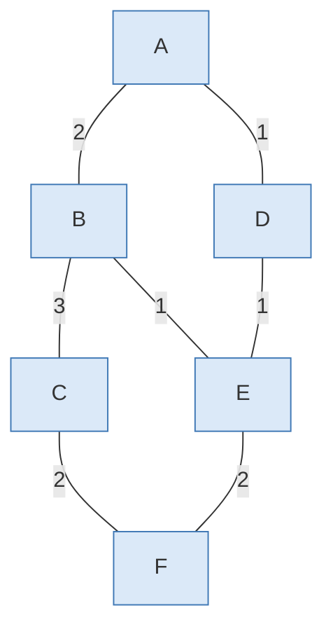
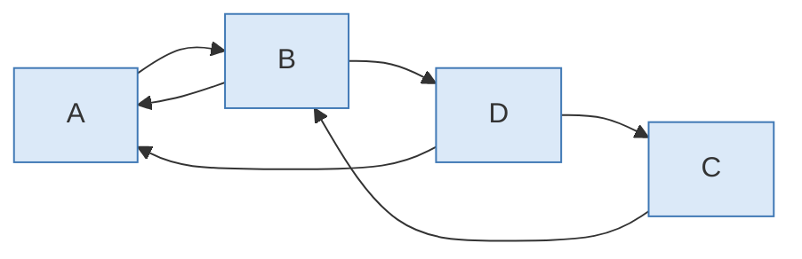
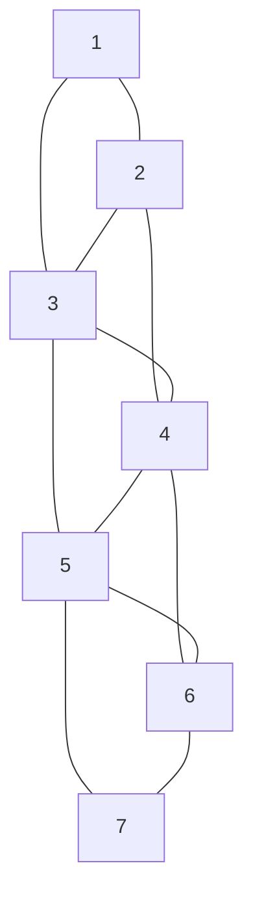
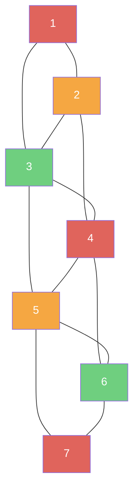
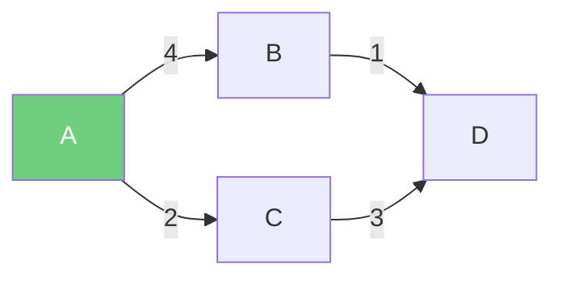
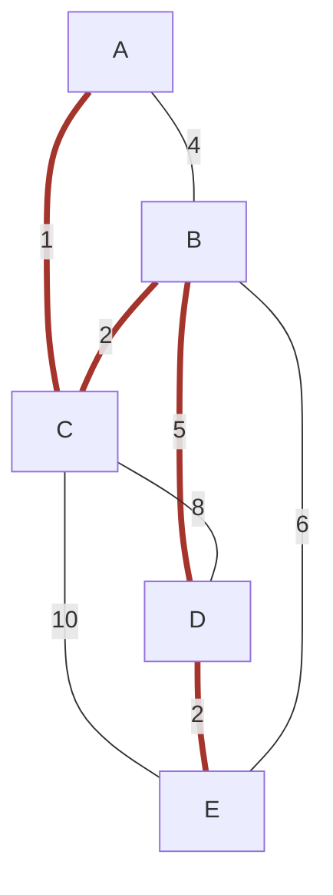
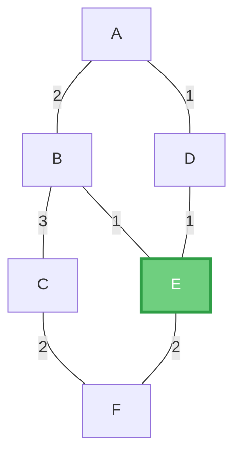

# Algoritmos sobre grafos — Guía a detalle

> Solo algoritmos de grafos (Floyd-Warshall, cerradura transitiva,
> coloreado, Dijkstra, Prim, Kruskal y centralidad por cercanía). Cada uno
> con su idea central, el pseudocódigo/código, un ejemplo resuelto paso a
> paso y su grafo en Mermaid.

---

## 1. Floyd-Warshall — ruta mínima entre **todos** los pares de nodos

**Idea central:** para cada posible nodo intermediario $k$ (de 1 a $n$), se
pregunta: *¿es más corto ir de $i$ a $j$ pasando por $k$, que la mejor ruta
conocida hasta ahora?*

$$d[i][j] = \min\big(d[i][j],\ d[i][k] + d[k][j]\big)$$

```cpp
for (k = 0; k < n; k++)
  for (i = 0; i < n; i++)
    for (j = 0; j < n; j++)
      if (matriz[i][k] != INF && matriz[k][j] != INF)
        if (matriz[i][j] > matriz[i][k] + matriz[k][j]) {
          matriz[i][j] = matriz[i][k] + matriz[k][j];
          sig[i][j] = sig[i][k]; // se guarda la ruta
        }
```

Se deja que $k$ recorra **todos** los nodos, uno a la vez, probando si
"atajar" por ahí mejora cualquier par $(i,j)$. Por eso son 3 ciclos
anidados: **complejidad $O(n^3)$**, sin importar cuántas aristas tenga el
grafo (a diferencia de Dijkstra, que sí depende del número de aristas).

### Problema



### Resolución

Después de correr el triple `for` (dejando pasar $k=A,B,C,D,E,F$ como
intermediario), la matriz de distancias mínimas queda:

| | A | B | C | D | E | F |
|---|---|---|---|---|---|---|
| **A** | 0 | 2 | 5 | 1 | 2 | 4 |
| **B** | 2 | 0 | 3 | 2 | 1 | 3 |
| **C** | 5 | 3 | 0 | 5 | 4 | 2 |
| **D** | 1 | 2 | 5 | 0 | 1 | 3 |
| **E** | 2 | 1 | 4 | 1 | 0 | 2 |
| **F** | 4 | 3 | 2 | 3 | 2 | 0 |

Por ejemplo, $A$ y $C$ no tienen arista directa: la ruta más corta es
$A \to B \to C = 2+3=5$. Y ojo con $B\to D$: la ruta directa $B{-}A{-}D$
da $2+1=3$, pero pasando por $E$ ($B{-}E{-}D=1+1=2$) es más corta —
exactamente el tipo de atajo que Floyd-Warshall encuentra al probar
**todos** los intermediarios posibles.

### Matriz de trayectorias (predecesores)

Además del costo, se guarda en una matriz `P*` quién es el "paso
anterior" en la ruta óptima de $i$ a $j$. Para reconstruir una ruta se
sigue esa cadena hacia atrás. Por ejemplo, si $P[D][C]=E$ y $P[D][E]=D$,
la ruta de $D$ a $C$ es $D \to E \to F \to C$ (se lee retrocediendo desde
el destino hasta toparse con el origen).

### Para reforzar

Floyd-Warshall funciona incluso con **pesos negativos** (siempre que no
haya ciclos de peso negativo), algo que Dijkstra no soporta. Es la
elección natural cuando se necesitan las distancias entre **todos** los
pares de nodos a la vez; si solo importa un origen fijo, Dijkstra es más
eficiente ($O(n^2)$, o $O((n+|E|)\log n)$ con cola de prioridad).

---

## 2. Cerradura transitiva (Warshall booleano)

Misma estructura de triple `for` que Floyd-Warshall, pero en vez de sumar
costos, se pregunta si **existe** un camino:

```cpp
M[i][j] = M[i][j] || (M[i][k] && M[k][j]);
```

El resultado es una matriz de **alcanzabilidad**: `M[i][j] = 1` si existe
algún camino de `i` a `j` (directo o a través de otros nodos), sin
importar cuán largo sea.

### Problema



### Resolución

Matriz de adyacencia inicial $M_0$:

| $M_0$ | A | B | C | D |
|---|---|---|---|---|
| A | 0 | 1 | 0 | 0 |
| B | 1 | 0 | 0 | 1 |
| C | 0 | 1 | 0 | 0 |
| D | 1 | 0 | 1 | 0 |

Cerradura transitiva $M^{*}$ (tras el triple `for` booleano):

| $M^{*}$ | A | B | C | D |
|---|---|---|---|---|
| A | 1 | 1 | 1 | 1 |
| B | 1 | 1 | 1 | 1 |
| C | 1 | 1 | 1 | 1 |
| D | 1 | 1 | 1 | 1 |

Como $A\to B\to D\to C\to B\to A$ termina cerrando el ciclo entre los
cuatro nodos, **todos alcanzan a todos**: el grafo es fuertemente conexo.

---

## 3. Coloreado de grafos

**Objetivo:** asignar colores a los vértices de modo que dos vértices
adyacentes nunca compartan color, usando la menor cantidad de colores
posible (el **número cromático** del grafo).

```cpp
for (i = 1; i <= n; i++) {
  color_actual = 1;
  while (true) {
    conflicto = false;
    for (vecino de i)
      if (grafo[i][vecino] == 1 && colores[vecino] == color_actual)
        conflicto = true;
    if (!conflicto) { colores[i] = color_actual; break; }
    color_actual++;
  }
}
```

Para cada vértice (en orden), se prueba el color más pequeño disponible
que ningún vecino ya tenga asignado.

### Problema



### Resolución

Aplicando el algoritmo voraz en orden $1 \to 7$:

| Nodo | 1 | 2 | 3 | 4 | 5 | 6 | 7 |
|---|---|---|---|---|---|---|---|
| Color | 1 | 2 | 3 | 1 | 2 | 3 | 1 |



Se necesitan **3 colores** como mínimo: los nodos $2,3,4$ forman un
triángulo (todos conectados entre sí), así que esos tres nunca pueden
compartir color entre ellos — eso ya obliga a un mínimo de 3.

### Para reforzar

Este algoritmo voraz **no siempre** da el número cromático óptimo — el
resultado depende del **orden** en que se recorren los vértices. Por eso
existe la variante de **Welsh-Powell**, que ordena los vértices de mayor
a menor grado antes de colorear, obteniendo mejores resultados en la
práctica. Encontrar el número cromático exacto de un grafo en general es
un problema **NP-difícil**.

**Aplicación típica:** asignar horarios a un grupo de personas de modo
que nadie tenga dos actividades que se solapan (cada actividad es un
vértice, y hay una arista si dos actividades no pueden coincidir en el
mismo horario/"color").

---

## 4. Dijkstra — ruta mínima desde **un** origen

```cpp
dist[origen] = 0;
for (i = 0; i < n; i++) {
  u = nodo no visitado con menor dist[u];
  visitado[u] = true;
  for (v vecino de u)
    if (dist[u] + peso(u, v) < dist[v])
      dist[v] = dist[u] + peso(u, v);
}
```

En cada paso se "fija" el nodo no visitado más cercano al origen ya
encontrado, y se actualizan (**relajan**) las distancias de sus vecinos
por si pasar por él resulta más corto.

### Problema



### Resolución

| Paso | Nodo fijado | dist[A] | dist[B] | dist[C] | dist[D] |
|---|---|---|---|---|---|
| 1 | A | 0 | 4 | 2 | ∞ |
| 2 | C (menor no visitado) | 0 | 4 | 2 | 5 (2+3) |
| 3 | B | 0 | 4 | 2 | 5 (4+1=5, no mejora) |
| 4 | D | 0 | 4 | 2 | 5 |

**Distancias finales desde A:** $A=0,\ B=4,\ C=2,\ D=5$. La ruta más corta
a $D$ es $A \to C \to D$ (peso 5): aunque $A \to B \to D$ también da 5,
Dijkstra siempre encuentra el valor mínimo correcto sin importar cuántas
rutas empaten.

### Para reforzar

**Restricción importante:** Dijkstra **solo funciona correctamente con
pesos no negativos**. El algoritmo asume que, una vez que un nodo se
marca como visitado, su distancia ya es la mínima posible — y eso deja
de ser cierto si una arista negativa pudiera "acortar" el camino después
de esa marca. Para grafos con pesos negativos (sin ciclos negativos) se
usa **Bellman-Ford** en su lugar.

---

## 5. Prim y Kruskal — árbol de expansión mínima

**Objetivo común:** conectar todos los nodos con el **menor costo total**
posible, sin formar ciclos (un árbol con $n-1$ aristas para $n$ nodos).



*(en rojo, el árbol de expansión mínima que ambos algoritmos van a
encontrar — verifícalo abajo con cada método)*

### 5.1 Prim — crece **nodo por nodo**

```pseudocódigo
Algoritmo_Prim_Matriz(MatrizCostos, TotalNodos, NodoInicial)
  costo_minimo[NodoInicial] = 0
  Para i desde 1 hasta TotalNodos:
    NodoActual = nodo no visitado con menor costo_minimo
    visitado[NodoActual] = Verdadero
    Para cada vecino de NodoActual:
      Si el costo directo es menor que costo_minimo[vecino]:
        costo_minimo[vecino] = costo directo
        padre[vecino] = NodoActual
  Devolver padre
```

El árbol siempre está **conectado**: en cada paso se agrega el vértice
más barato que conecta el árbol ya construido con el resto del grafo.

**Trazado, arrancando en $A$:**

| Paso | Nodo agregado | Arista usada | Costo |
|---|---|---|---|
| 1 | A | — | — (inicio) |
| 2 | C | A–C | 1 |
| 3 | B | B–C | 2 |
| 4 | D | B–D | 5 |
| 5 | E | D–E | 2 |

**Costo total: $1+2+5+2=10$.**

### 5.2 Kruskal — crece **por aristas**, sin importar dónde estén

```pseudocódigo
Algoritmo_Kruskal(aristas, n)
  ordenar todas las aristas de menor a mayor peso
  crear n conjuntos disjuntos, uno por cada nodo (cada nodo es su propio grupo)
  árbol = {}
  Para cada arista (u, v) en orden creciente de peso:
    Si encontrar(u) != encontrar(v):     // u y v NO están en el mismo grupo
      agregar (u, v) al árbol
      unir(u, v)                          // fusiona los dos grupos
  Devolver árbol
```

Usa una estructura de **conjuntos disjuntos (union-find)** para saber
rápidamente si dos nodos ya están conectados (y así evitar ciclos).

**Trazado:** aristas ordenadas por peso:
$A{-}C(1),\ B{-}C(2),\ D{-}E(2),\ A{-}B(4),\ B{-}D(5),\ B{-}E(6),\
C{-}D(8),\ C{-}E(10)$.

| Arista | Peso | ¿Mismo grupo? | Acción |
|---|---|---|---|
| A–C | 1 | No | ✅ se agrega — grupo $\{A,C\}$ |
| B–C | 2 | No | ✅ se agrega — grupo $\{A,B,C\}$ |
| D–E | 2 | No | ✅ se agrega — grupo $\{D,E\}$ |
| A–B | 4 | **Sí** | ❌ se descarta (formaría ciclo) |
| B–D | 5 | No | ✅ se agrega — une $\{A,B,C\}$ con $\{D,E\}$ |

Con 4 aristas agregadas para 5 nodos, el árbol ya está completo. **Costo
total: $1+2+2+5=10$** — el mismo que dio Prim, aunque el orden en que se
construyó fue distinto.

### Para reforzar

Prim crece un único árbol conectado paso a paso, mirando siempre "hacia
afuera" desde lo que ya construyó. Kruskal, en cambio, mira el grafo
**completo** de una vez y va tomando las aristas más baratas
globalmente, sin importar si están conectadas al árbol todavía. Ambos
algoritmos siempre dan el mismo costo total mínimo, aunque el árbol
resultante puede diferir si hay empates de peso (como pasó aquí con
$B{-}C=2$ y $D{-}E=2$).

---

## 6. Centralidad por cercanía

**Procedimiento:**

1. Para cada nodo, calcular las rutas más cortas hacia todos los demás
   (típicamente con Floyd-Warshall) y sumar esas distancias.
2. Normalizar: $\text{centralidad}(v) = \dfrac{n-1}{\text{suma de distancias desde } v}$
3. El nodo con **mayor** valor de centralidad es el más "cercano" en
   promedio a todos los demás.

### Problema

Reutilizando el grafo y la matriz de distancias de la sección 1
(Floyd-Warshall, $n=6$ nodos), ¿cuál nodo es el más central?

### Resolución

| Nodo | Suma de distancias | Centralidad $=5/\text{suma}$ |
|---|---|---|
| A | $2+5+1+2+4=14$ | 0.357 |
| B | $2+3+2+1+3=11$ | 0.455 |
| C | $5+3+5+4+2=19$ | 0.263 |
| D | $1+2+5+1+3=12$ | 0.417 |
| **E** | $2+1+4+1+2=10$ | **0.500** ✅ |
| F | $4+3+2+3+2=14$ | 0.357 |



**$E$ es el nodo más central**: tiene la menor suma acumulada de
distancias hacia el resto de la red, así que la mayor centralidad de
cercanía. Si esto representara sedes de una empresa, $E$ sería el mejor
punto de abastecimiento — la mercancía tarda menos, en promedio, en
llegar desde ahí a cualquier otra sede.

### Para reforzar

Esta métrica se llama *closeness centrality* en la literatura de
análisis de redes. Es distinta de la **centralidad de intermediación**
(*betweenness centrality*), que mide cuántas rutas más cortas **pasan
por** un nodo — no qué tan cerca está de los demás. Un nodo puede tener
alta cercanía sin ser un "puente" importante, y viceversa.
