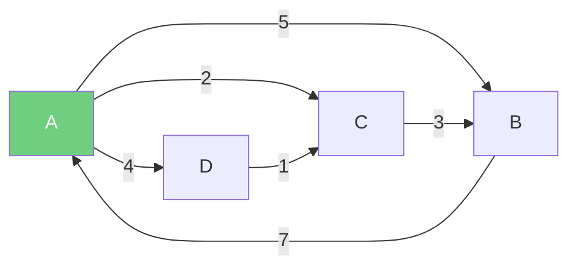
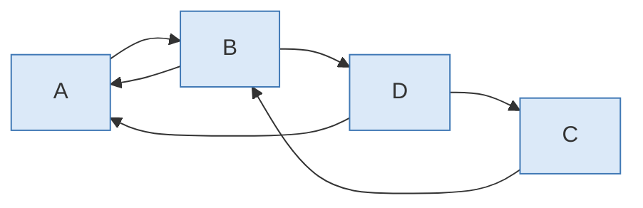
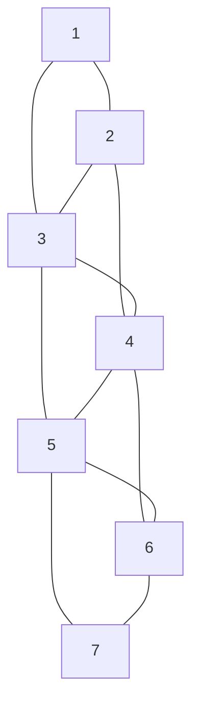
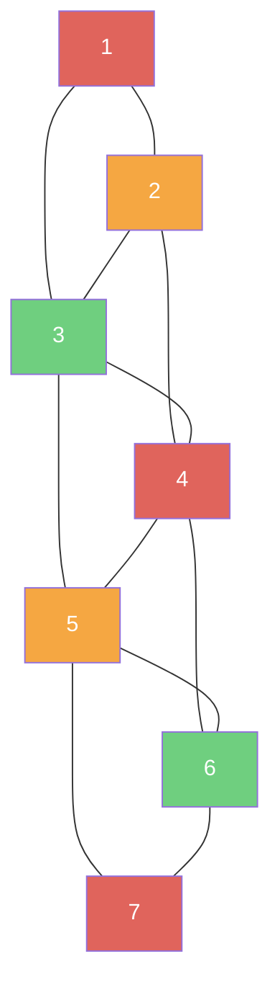
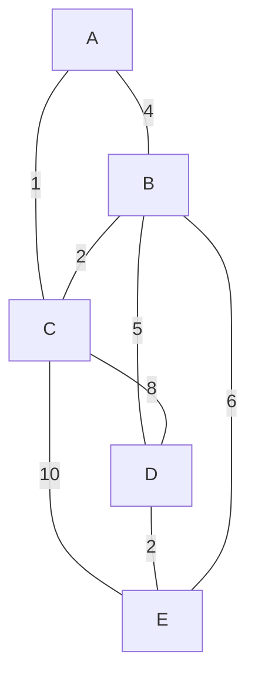
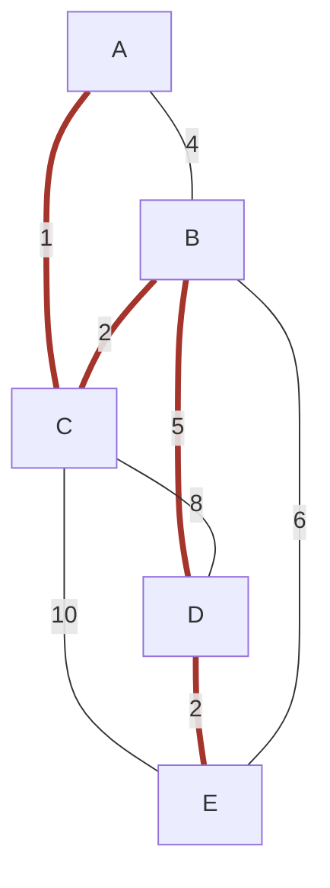
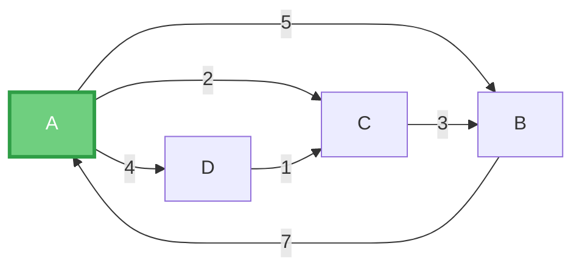
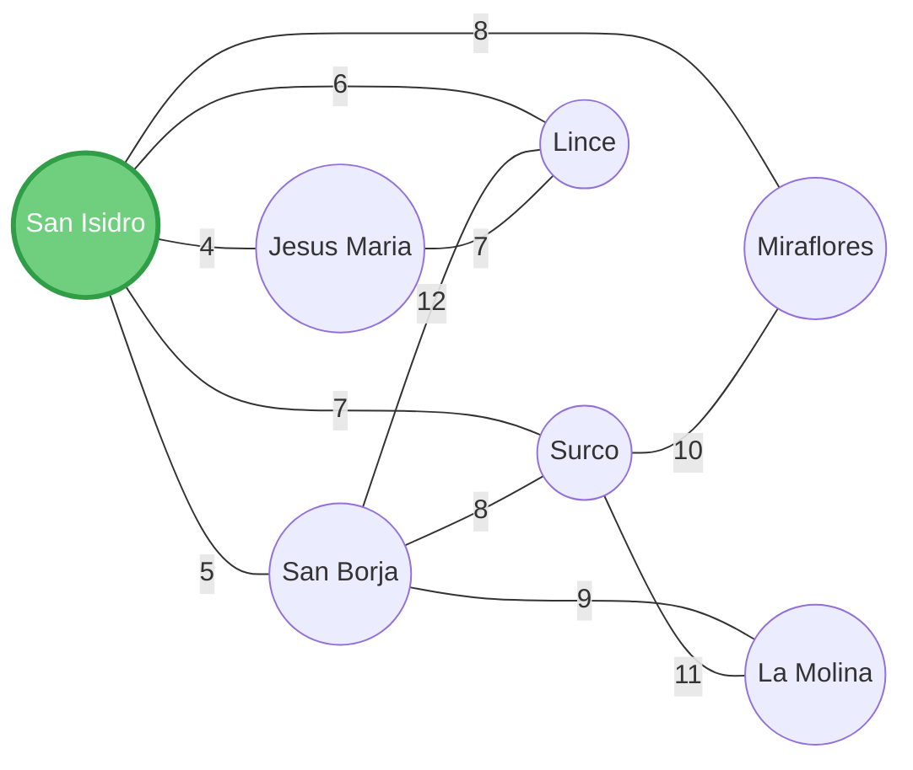

# Algoritmos sobre grafos — Guía a detalle (con iteraciones completas)

> Cada tema sigue el mismo orden: **teoría → código → un ejemplo resuelto
> mostrando TODAS las iteraciones** (matrices/tablas paso a paso), no solo
> el resultado final.

---

## 1. Floyd-Warshall — ruta mínima entre todos los pares de nodos

### Teoría

Para cada posible nodo intermediario k (de 1 a n), se pregunta: *¿es
más corto ir de i a j pasando por k, que la mejor ruta conocida
hasta ahora?*

$$d[i][j] = \min\big(d[i][j],\ d[i][k] + d[k][j]\big)$$

Se deja que $k$ recorra **todos** los nodos, uno a la vez. Son 3 ciclos
anidados → **complejidad $O(n^3)$**, sin importar cuántas aristas tenga
el grafo. Además de la matriz de distancias `D`, se lleva una matriz de
**predecesores** `P` para poder reconstruir la ruta completa, no solo su
costo.

### Código en C++

```cpp
#include <iostream>
using namespace std;
const int INF = 99999;

int main() {
    int i, j, k, n;
    int matriz[10][10];
    int sig[10][10]; // sig[i][j] = predecesor de j en la ruta i->j

    cout << "Ingrese cantidad de nodos: ";
    cin >> n;
    cout << "Ingrese matriz (use INF si no hay conexion):\n";
    for (i = 0; i < n; i++) {
        for (j = 0; j < n; j++) {
            if (i == j) {
                matriz[i][j] = 0;
                sig[i][j] = i;
            } else {
                cin >> matriz[i][j];
                sig[i][j] = (matriz[i][j] != INF) ? i : -1;
            }
        }
    }

    // Floyd-Warshall
    for (k = 0; k < n; k++)
        for (i = 0; i < n; i++)
            for (j = 0; j < n; j++)
                if (matriz[i][k] != INF && matriz[k][j] != INF)
                    if (matriz[i][j] > matriz[i][k] + matriz[k][j]) {
                        matriz[i][j] = matriz[i][k] + matriz[k][j];
                        sig[i][j] = sig[k][j]; // se hereda el predecesor desde k
                    }

    // Mostrar rutas
    cout << "\n--- RUTAS MINIMAS ---\n";
    for (i = 0; i < n; i++)
        for (j = 0; j < n; j++)
            if (i != j && sig[i][j] != -1)
                cout << "De " << i << " a " << j
                     << " | costo: " << matriz[i][j] << endl;
    return 0;
}
```

### Ejemplo — grafo dirigido de 4 nodos



**Matriz inicial $D^0$** (distancia directa; $\infty$ = sin conexión) y
**$P^0$** (predecesor directo — quién apunta a quién):

| $D^0$ | A | B | C | D | | $P^0$ | A | B | C | D |
|---|---|---|---|---|---|---|---|---|---|---|
| A | 0 | 5 | 2 | 4 | | A | — | A | A | A |
| B | 7 | 0 | ∞ | ∞ | | B | B | — | — | — |
| C | ∞ | 3 | 0 | ∞ | | C | — | C | — | — |
| D | ∞ | ∞ | 1 | 0 | | D | — | — | D | — |

**Iteración $k=1$ (intermediario A):** se revisa si pasar por $A$ mejora
algo. Solo cambia lo que sale de $B$ (porque $B \to A = 7$ es la única
conexión hacia $A$ que sirve de "entrada" para atajar):
$B\to C = \min(\infty,\ 7+2)=9$, $\ B\to D=\min(\infty,\ 7+4)=11$.

| $D^1$ | A | B | C | D | | $P^1$ | A | B | C | D |
|---|---|---|---|---|---|---|---|---|---|---|
| A | 0 | 5 | 2 | 4 | | A | — | A | A | A |
| B | 7 | 0 | **9** | **11** | | B | B | — | **A** | **A** |
| C | ∞ | 3 | 0 | ∞ | | C | — | C | — | — |
| D | ∞ | ∞ | 1 | 0 | | D | — | — | D | — |

**Iteración $k=2$ (intermediario B):** ahora se prueba pasar por $B$.
Como $C\to B=3$ es la entrada, se revisa qué sale de $B$: $C\to A =
\min(\infty,\ 3+7)=10$, $\ C\to D=\min(\infty,\ 3+11)=14$.

| $D^2$ | A | B | C | D | | $P^2$ | A | B | C | D |
|---|---|---|---|---|---|---|---|---|---|---|
| A | 0 | 5 | 2 | 4 | | A | — | A | A | A |
| B | 7 | 0 | 9 | 11 | | B | B | — | A | A |
| C | **10** | 3 | 0 | **14** | | C | **B** | C | — | **B** |
| D | ∞ | ∞ | 1 | 0 | | D | — | — | D | — |

**Iteración $k=3$ (intermediario C):** entrada por $D\to C=1$: $D\to A =
\min(\infty,\ 1+10)=11$, $\ D\to B=\min(\infty,\ 1+3)=4$.

| $D^3$ | A | B | C | D | | $P^3$ | A | B | C | D |
|---|---|---|---|---|---|---|---|---|---|---|
| A | 0 | 5 | 2 | 4 | | A | — | A | A | A |
| B | 7 | 0 | 9 | 11 | | B | B | — | A | A |
| C | 10 | 3 | 0 | 14 | | C | B | C | — | B |
| D | **11** | **4** | 1 | 0 | | D | **C** | **C** | D | — |

**Iteración $k=4$ (intermediario D) — resultado final:** se revisa si
pasar por $D$ mejora algo más. Probando, por ejemplo, $A\to B$ vía $D$:
$d[A][D]+d[D][B]=4+4=8$, peor que el $5$ que ya había → no cambia. Al
revisar todos los pares, **no hay más mejoras**, así que $D^4=D^3$:

| $D^{*}$ | A | B | C | D | | $P^{*}$ | A | B | C | D |
|---|---|---|---|---|---|---|---|---|---|---|
| A | 0 | 5 | 2 | 4 | | A | — | A | A | A |
| B | 7 | 0 | 9 | 11 | | B | B | — | A | A |
| C | 10 | 3 | 0 | 14 | | C | B | C | — | B |
| D | 11 | 4 | 1 | 0 | | D | C | C | D | — |

### Lectura de rutas desde $P^{*}$

Para reconstruir una ruta de $i$ a $j$, se sigue la cadena de
predecesores **hacia atrás** desde $j$ hasta llegar a $i$:

- **$D \to B$** (distancia 4): $P[D][B]=C \to P[D][C]=D$ → ruta:
  $D \to C \to B$.
- **$B \to C$** (distancia 9): $P[B][C]=A \to P[B][A]=B$ → ruta:
  $B \to A \to C$.
- **$C \to A$** (distancia 10): $P[C][A]=B \to P[C][B]=C$ → ruta:
  $C \to B \to A$.
- **$C \to D$** (distancia 14): $P[C][D]=B \to P[C][B]=C$ → ruta:
  $C \to B \to A \to D$.

Como el grafo tiene 4 vértices, se hacen exactamente 4 iteraciones (k=1, k=2, k=3, k=4). En cada una se revisan los 4×4 = 16 pares, dando 64 iteraciones totales. Solo se registran en la matriz los pares donde el valor mejora; los demás conservan su valor anterior.

---

## 2. Cerradura transitiva (Warshall booleano)

### Teoría

Misma estructura de triple `for` que Floyd-Warshall, pero en vez de sumar
costos, se pregunta si **existe** un camino (sin importar la distancia):

$$M[i][j] = M[i][j] \ \lor\ \big(M[i][k] \land M[k][j]\big)$$

El resultado es una matriz de **alcanzabilidad**: `M[i][j] = 1` si existe
algún camino de `i` a `j`, directo o a través de otros nodos.

### Código en C++

```cpp
#include <iostream>
using namespace std;
int main() {
    int n = 4; // A=0, B=1, C=2, D=3
    bool M[4][4] = {
        {0, 1, 0, 0}, // A -> B
        {1, 0, 0, 1}, // B -> A, D
        {0, 1, 0, 0}, // C -> B
        {1, 0, 1, 0}  // D -> A, C
    };
    for (int k = 0; k < n; k++)
        for (int i = 0; i < n; i++)
            for (int j = 0; j < n; j++)
                M[i][j] = M[i][j] || (M[i][k] && M[k][j]);

    cout << "=== MATRIZ DE CERRADURA ===\n\tA\tB\tC\tD\n";
    char letras[] = {'A','B','C','D'};
    for (int i = 0; i < n; i++) {
        cout << letras[i] << " |\t";
        for (int j = 0; j < n; j++) cout << M[i][j] << "\t";
        cout << endl;
    }
    return 0;
}
```

### Ejemplo — mismo grafo dirigido de 4 nodos



**$M^0$ (adyacencia inicial):**

| $M^0$ | A | B | C | D |
|---|---|---|---|---|
| A | 0 | 1 | 0 | 0 |
| B | 1 | 0 | 0 | 1 |
| C | 0 | 1 | 0 | 0 |
| D | 1 | 0 | 1 | 0 |

**Iteración $k=A$:** cualquier fila con `1` en la columna A hereda la
fila de A. Eso son las filas $B$ y $D$: $B$ gana $B{-}B=1$ (porque
$B\to A \to B$... en realidad $A\to B=1$, y $B\to A=1$, entonces $B\to
B$ se activa); $D$ gana $D\to B=1$.

| $M^1$ | A | B | C | D |
|---|---|---|---|---|
| A | 0 | 1 | 0 | 0 |
| B | 1 | **1** | 0 | 1 |
| C | 0 | 1 | 0 | 0 |
| D | 1 | **1** | 1 | 0 |

**Iteración $k=B$:** la columna $B$ ahora tiene `1` en **todas** las
filas ($A,B,C,D$ todas llegan a $B$). Entonces **todas** las filas heredan
la fila de $B$ = $[1,1,0,1]$:

| $M^2$ | A | B | C | D |
|---|---|---|---|---|
| A | **1** | 1 | 0 | **1** |
| B | 1 | 1 | 0 | 1 |
| C | **1** | 1 | 0 | **1** |
| D | 1 | 1 | 1 | 1 |

**Iteración $k=C$:** columna $C$ solo tiene `1` en la fila $D$, y $D$ ya
tiene todo en `1` → **no hay cambios**.

| $M^3$ | A | B | C | D |
|---|---|---|---|---|
| A | 1 | 1 | 0 | 1 |
| B | 1 | 1 | 0 | 1 |
| C | 1 | 1 | 0 | 1 |
| D | 1 | 1 | 1 | 1 |

**Iteración $k=D$ — resultado final:** columna $D$ ya tiene `1` en todas
las filas. Todas heredan la fila de $D=[1,1,1,1]$:

| $M^{*}$ | A | B | C | D |
|---|---|---|---|---|
| A | **1** | 1 | **1** | 1 |
| B | 1 | 1 | **1** | 1 |
| C | 1 | 1 | **1** | 1 |
| D | 1 | 1 | 1 | 1 |

**Conclusión:** todos los `1` → el grafo es **fuertemente conexo**,
cualquier nodo puede llegar a cualquier otro.

---

## 3. Coloreado de grafos

### Teoría

Se busca asignar colores a los vértices de modo que dos vértices
adyacentes nunca compartan color, usando la menor cantidad posible (el
**número cromático**). El algoritmo voraz revisa, para cada vértice en
orden, el color más pequeño que ningún vecino ya coloreado esté usando.

### Código en C++

```cpp
for (int i = 1; i <= n; i++) {
    int color_actual = 1;
    while (true) {
        bool conflicto = false;
        for (int vecino = 1; vecino <= n; vecino++)
            if (grafo[i][vecino] == 1 && colores[vecino] == color_actual)
                { conflicto = true; break; }
        if (!conflicto) { colores[i] = color_actual; break; }
        color_actual++;
    }
}
```

### Ejemplo



**Trazado nodo por nodo** (vecinos ya coloreados y color asignado):

| Nodo | Vecinos con color ya asignado | Colores en uso por vecinos | Color elegido |
|---|---|---|---|
| 1 | ninguno | — | **1** |
| 2 | 1 | {1} | **2** (1 está ocupado) |
| 3 | 1, 2 | {1, 2} | **3** (1 y 2 ocupados) |
| 4 | 2, 3 | {2, 3} | **1** (libre) |
| 5 | 3, 4 | {3, 1} | **2** (libre) |
| 6 | 4, 5 | {1, 2} | **3** (libre) |
| 7 | 5, 6 | {2, 3} | **1** (libre) |



Se necesitan **3 colores** como mínimo: los nodos $2,3,4$ forman un
triángulo (todos conectados entre sí), así que esos tres nunca pueden
compartir color — eso ya obliga a un mínimo de 3.


---

## 4. Dijkstra — ruta mínima desde un origen

### Teoría

En cada paso se "fija" el nodo no visitado más cercano al origen ya
encontrado, y se actualizan (**relajan**) las distancias de sus vecinos
por si pasar por él resulta más corto. A diferencia de Floyd-Warshall,
solo calcula rutas **desde un origen**, no entre todos los pares.

### Código en C++

```cpp
int dist[n], visitado[n] = {false};
for (int i = 0; i < n; i++) dist[i] = INF;
dist[origen] = 0;

for (int i = 0; i < n; i++) {
    int u = -1, minDist = INF;
    for (int j = 0; j < n; j++)
        if (!visitado[j] && dist[j] < minDist) { minDist = dist[j]; u = j; }
    visitado[u] = true;

    for (int v = 0; v < n; v++)
        if (!visitado[v] && grafo[u][v] != INF && dist[u]+grafo[u][v] < dist[v])
            dist[v] = dist[u] + grafo[u][v];
}
```

### Ejemplo — usando el mismo grafo dirigido de las secciones 1 y 2


**Origen: $A$.** Se traza cada iteración, marcando qué nodo se fija y
cómo se actualizan sus vecinos:

| Paso | Nodo fijado | dist[A] | dist[B] | dist[C] | dist[D] | Actualización |
|---|---|---|---|---|---|---|
| 0 (inicio) | — | 0 | ∞ | ∞ | ∞ | dist[A]=0 |
| 1 | **A** (dist 0) | 0 | 5 | 2 | 4 | A→B=5, A→C=2, A→D=4 |
| 2 | **C** (dist 2, la menor no visitada) | 0 | **min(5, 2+3)=5** | 2 | 4 | C→B=3, pero 2+3=5 no mejora el 5 ya visto |
| 3 | **D** (dist 4) | 0 | 5 | **min(2, 4+1)=2** | 4 | D→C=1, pero 4+1=5 no mejora el 2 |
| 4 | **B** (dist 5) | 0 | 5 | 2 | 4 | B→A=7, pero 5+7=12 no mejora |

**Distancias finales desde $A$:** $A=0,\ B=5,\ C=2,\ D=4$. Con la matriz
de predecesores del método (guardando desde qué nodo se relajó cada
vecino), la ruta a cualquier destino se reconstruye igual que en
Floyd-Warshall.


---

## 5. Prim y Kruskal — árbol de expansión mínima

### Teoría

Ambos buscan conectar todos los nodos con el **menor costo total**
posible, sin ciclos ($n-1$ aristas para $n$ nodos):

- **Prim** crece un único árbol, **nodo por nodo**, agregando siempre la
  arista más barata que conecta el árbol con el resto del grafo.
- **Kruskal** ordena **todas** las aristas del grafo y las va tomando de
  menor a mayor peso, usando **conjuntos disjuntos (union-find)** para
  descartar las que formarían un ciclo.

### Grafo de ejemplo (compartido por ambos)



### 5.1 Prim — código

```pseudocódigo
Algoritmo_Prim_Matriz(MatrizCostos, TotalNodos, NodoInicial)
  costo_minimo[NodoInicial] = 0
  Para i desde 1 hasta TotalNodos:
    NodoActual = nodo no visitado con menor costo_minimo
    visitado[NodoActual] = Verdadero
    Para cada vecino de NodoActual:
      Si el costo directo es menor que costo_minimo[vecino]:
        costo_minimo[vecino] = costo directo
        padre[vecino] = NodoActual
  Devolver padre
```

**Trazado completo, arrancando en $A$** — se muestra el arreglo
`costo_minimo[]` completo en cada iteración, no solo el nodo elegido:

| Iteración | Nodo fijado | costo_min[A] | costo_min[B] | costo_min[C] | costo_min[D] | costo_min[E] |
|---|---|---|---|---|---|---|
| 0 (inicio) | — | 0 | ∞ | ∞ | ∞ | ∞ |
| 1 | **A** | 0 | 4 | 1 | ∞ | ∞ |
| 2 | **C** (costo 1) | 0 | **2** | 1 | ∞ | ∞ |
| 3 | **B** (costo 2) | 0 | 2 | 1 | **5** | **6** |
| 4 | **E** (costo… espera) | — | — | — | — | — |

> Nota: al llegar a este punto, $D$ y $E$ compiten por el menor costo
> parcial. $D$ vale $5$ (por $B{-}D$) y $E$ vale $6$ (por $B{-}E$), así
> que se fija $D$ primero:

| Iteración | Nodo fijado | costo_min[A] | costo_min[B] | costo_min[C] | costo_min[D] | costo_min[E] |
|---|---|---|---|---|---|---|
| 4 | **D** (costo 5) | 0 | 2 | 1 | 5 | **2** (D–E=2 < 6) |
| 5 | **E** (costo 2) | 0 | 2 | 1 | 5 | 2 |

**Aristas elegidas (por el arreglo `padre[]`):** A-C(1),\ C-B(2),\
B-D(5),\ D-E(2). **Costo total $=1+2+5+2=10$.**

### 5.2 Kruskal — código

```pseudocódigo
Algoritmo_Kruskal(aristas, n)
  ordenar todas las aristas de menor a mayor peso
  crear n conjuntos disjuntos, uno por cada nodo
  árbol = {}
  Para cada arista (u, v) en orden creciente de peso:
    Si encontrar(u) != encontrar(v):
      agregar (u, v) al árbol
      unir(u, v)
  Devolver árbol
```

**Trazado completo**, mostrando el estado de los conjuntos disjuntos tras
cada decisión:

| Arista | Peso | Grupo(u) | Grupo(v) | ¿Se agrega? | Conjuntos tras este paso |
|---|---|---|---|---|---|
| A–C | 1 | {A} | {C} |  Sí | {A,C}, {B}, {D}, {E} |
| B–C | 2 | {B} | {A,C} |  Sí | {A,B,C}, {D}, {E} |
| D–E | 2 | {D} | {E} |  Sí | {A,B,C}, {D,E} |
| A–B | 4 | {A,B,C} | {A,B,C} |  No (mismo grupo → ciclo) | {A,B,C}, {D,E} |
| B–D | 5 | {A,B,C} | {D,E} |  Sí | {A,B,C,D,E} — ¡ya está todo unido! |

Con 4 aristas agregadas para 5 nodos, el árbol queda completo. **Costo
total $=1+2+2+5=10$** — idéntico al de Prim, aunque el orden de
construcción fue distinto.



*(en rojo, el árbol de expansión mínima final — el mismo resultado sea
cual sea el algoritmo usado)*


Prim mira siempre "hacia afuera" desde el árbol que ya construyó.
Kruskal mira el grafo **completo** de una vez, sin importar si las
aristas están conectadas al árbol todavía. Ambos dan el mismo costo
mínimo, aunque el árbol resultante puede diferir si hay empates de peso
(como pasó aquí con $B{-}C=2$ y $D{-}E=2$).

---

## 6. Centralidad por cercanía

### Teoría

1. Para cada nodo, se suman sus distancias más cortas hacia todos los
   demás (usando, por ejemplo, la matriz $D^{*}$ de Floyd-Warshall).
2. Se normaliza: $\text{centralidad}(v) = \dfrac{n-1}{\text{suma de distancias desde } v}$
3. El nodo con **mayor** valor es el más "cercano" en promedio a todos
   los demás.

### Ejemplo — reutilizando la matriz $D^{*}$ de la sección 1

| Nodo | Distancias hacia los demás | Suma | Centralidad $=\dfrac{3}{\text{suma}}$ |
|---|---|---|---|
| **A** | $5,\ 2,\ 4$ | $11$ | $3/11=\mathbf{0.273}$  |
| B | $7,\ 9,\ 11$ | $27$ | $3/27=0.111$ |
| C | $10,\ 3,\ 14$ | $27$ | $3/27=0.111$ |
| D | $11,\ 4,\ 1$ | $16$ | $3/16=0.1875$ |



**$A$ es el nodo más central**: es el que, en promedio, llega más rápido
a cualquier otro nodo de la red. Tiene sentido mirando el grafo: $A$
tiene salida directa hacia los tres nodos restantes, mientras que $B$,
$C$ y $D$ dependen de rutas más largas para alcanzarse entre sí.

### Ejemplo aplicado — punto de abastecimiento en Lima
 
Una transnacional de productos de belleza tiene
7 sedes en Lima. ¿Cuál sede debería ser el punto de abastecimiento
principal, y por qué?
 

 
*(pesos = costo de distribución en soles)*
 
**Código en C++:**
 
```cpp
#include <iostream>
using namespace std;
const int INF = 99999; // Representa que no hay conexión directa
 
int main() {
    int n = 7; // Total de sedes en Lima
    string sedes[] = {"San Isidro", "San Borja", "Surco", "Jesus Maria",
                       "Lince", "Miraflores", "La Molina"};
    int D[7][7] = {
        {0, 5, 7, 4, 6, 8, INF},    // San Isidro
        {5, 0, 8, INF, 12, INF, 9}, // San Borja
        {7, 8, 0, INF, INF, 10, 11},// Surco
        {4, INF, INF, 0, 7, INF, INF}, // Jesus Maria
        {6, 12, INF, 7, 0, INF, INF},  // Lince
        {8, INF, 10, INF, INF, 0, INF},// Miraflores
        {INF, 9, 11, INF, INF, INF, 0} // La Molina
    };
 
    // 2. Ejecutar Floyd-Warshall para obtener TODAS las rutas más cortas
    for (int k = 0; k < n; k++)
        for (int i = 0; i < n; i++)
            for (int j = 0; j < n; j++)
                if (D[i][k] + D[k][j] < D[i][j])
                    D[i][j] = D[i][k] + D[k][j];
 
    // Variables para buscar la sede con la mayor centralidad
    int sede_optima = 0;
    double max_centralidad = -1.0;
    cout << "=== ANALISIS DE CENTRALIDAD DE CERCANIA ===" << endl;
 
    // 3. Calcular la Longitud Total y la Normalizacion para cada nodo
    for (int i = 0; i < n; i++) {
        double longitud_total = 0;
        for (int j = 0; j < n; j++)
            if (i != j && D[i][j] != INF)
                longitud_total += D[i][j];
 
        double centralidad = (n - 1) / longitud_total;
        cout << sedes[i] << " -> Suma Distancias: " << longitud_total
             << " | Centralidad: " << centralidad << endl;
 
        if (centralidad > max_centralidad) {
            max_centralidad = centralidad;
            sede_optima = i;
        }
    }
 
    cout << "--------------------------------------------------------" << endl;
    cout << "\n>>> PUNTO DE ABASTECIMIENTO PRINCIPAL SELECCIONADO <<<" << endl;
    cout << "Sede: " << sedes[sede_optima] << endl;
    cout << "Valor de Importancia (Mayor): " << max_centralidad << endl;
    cout << "Razon: Es el nodo con menor esfuerzo acumulado de viaje hacia toda la red." << endl;
    return 0;
}
```
 
**Resolución — corriendo Floyd-Warshall a mano sobre esa matriz**, la
suma de distancias mínimas desde cada sede hacia las otras 6 queda:
 
| Sede | Suma de distancias | Centralidad $=6/\text{suma}$ |
|---|---|---|
| **San Isidro** | $5+7+4+6+8+14=44$ | $6/44=\mathbf{0.136}$  |
| San Borja | $5+8+9+11+13+9=55$ | $6/55=0.109$ |
| Surco | $7+8+11+13+10+11=60$ | $6/60=0.100$ |
| Jesús María | $4+9+11+7+12+18=61$ | $6/61=0.098$ |
| Lince | $6+11+13+7+14+20=71$ | $6/71=0.085$ |
| Miraflores | $8+13+10+12+14+21=78$ | $6/78=0.077$ |
| La Molina | $14+9+11+18+20+21=93$ | $6/93=0.065$ |
 
**San Isidro es el punto de abastecimiento óptimo**: tiene la menor
suma acumulada de distancias hacia el resto de sedes, y por lo tanto la
mayor centralidad de cercanía. Se ve claro en el grafo — San Isidro es
el único nodo con conexión **directa** a las otras cuatro sedes más
cercanas ($SB, SU, JM, MI$), así que en promedio le toma menos esfuerzo
de reparto llegar a cualquier otra sede que a cualquiera de sus
competidoras dentro de la red.
