# Árboles — Guía a detalle

> Cubre todos los subtemas de árboles vistos en el material: definición,
> alturas, teoremas de conteo (con demostración), camino único, longitud
> de camino externo, recorridos, árboles de búsqueda binaria (ABB),
> eliminación, factor de equilibrio y las 4 rotaciones AVL, cerrando con
> un ejercicio integrador completo.

---

## 1. Definición y terminología

Un árbol es una estructura de datos (y también un tipo especial de
grafo) formada por nodos conectados entre sí, donde:

- Hay un nodo principal llamado **raíz**.
- Cada nodo puede tener **hijos**.
- **No existen ciclos** (no puedes volver al mismo nodo siguiendo
  enlaces).
- Existe un **único camino** entre dos nodos cualesquiera (esto se
  demuestra en la sección 6).

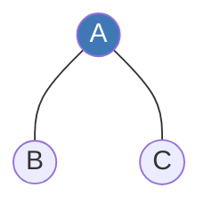

- **Padre de B:** A. **Padre de C:** A.
- **Hijos de A:** B y C.
- **Hoja:** un nodo sin hijos (aquí, B y C son hojas).

---

## 2. Vértices y alturas

La **altura** $h$ de un árbol es la distancia (en aristas) desde la raíz
hasta el nivel más profundo.

**Árbol de altura $h=0$** ($V=\{a\}$):

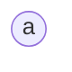

**Árbol de altura $h=1$** ($V=\{a,b\}$):

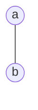

**Árbol de altura $h=2$** ($V=\{a,b,c,d,e\}$):

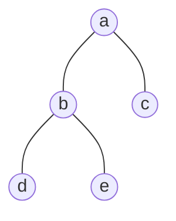

En el último árbol: $h(a)=h=2$ (la raíz está a 2 niveles de las hojas más
profundas), $h(b)=h(c)=1$, y $h(d)=h(e)=0$ (son hojas, altura 0).

---

## 3. Teorema: $|V| = m \cdot i + 1$ (árbol $m$-ario completo)

**Enunciado:** en un árbol $m$-ario **completo** (cada nodo interno tiene
exactamente $m$ hijos), se cumple:

$$|V| = m \cdot i + 1$$

donde $|V|$ = número total de vértices, $m$ = cantidad exacta de hijos
por nodo interno, $i$ = cantidad de nodos internos.

**Por qué:** cada uno de los $i$ nodos internos "genera" exactamente $m$
hijos nuevos. Empezando de 1 sola raíz, el total de nodos creados por
esos hijos es $m \cdot i$, y sumando la raíz original se llega a
$m \cdot i + 1$.

---

## 4. Relación $n = i + l$ y su fórmula asociada

**Regla de oro:** en cualquier árbol, todo nodo es de uno de dos tipos:
**interno** ($i$, tiene hijos) o **hoja** ($l$, no tiene hijos). No hay
un tercer tipo, así que:

$$n = i + l$$

### Demostración de $|V| = m\cdot i + 1$ por inducción

**Caso base ($i=0$):** cero nodos internos significa que ningún nodo
tiene hijos → el árbol es un solo nodo aislado (la raíz). Entonces
$|V|=1$. Evaluando la fórmula: $|V| = m\cdot(0)+1 = 1$. ✅ Coincide.

**Hipótesis inductiva:** se asume que la fórmula es válida para
cualquier árbol $m$-ario completo con exactamente $k$ nodos internos:
$|V_k| = m\cdot k + 1$.

**Paso inductivo ($i=k+1$):** para pasar de $k$ a $k+1$ nodos internos,
se toma una **hoja** existente y se convierte en nodo interno agregándole
exactamente $m$ hijos nuevos (para que el árbol siga siendo completo):

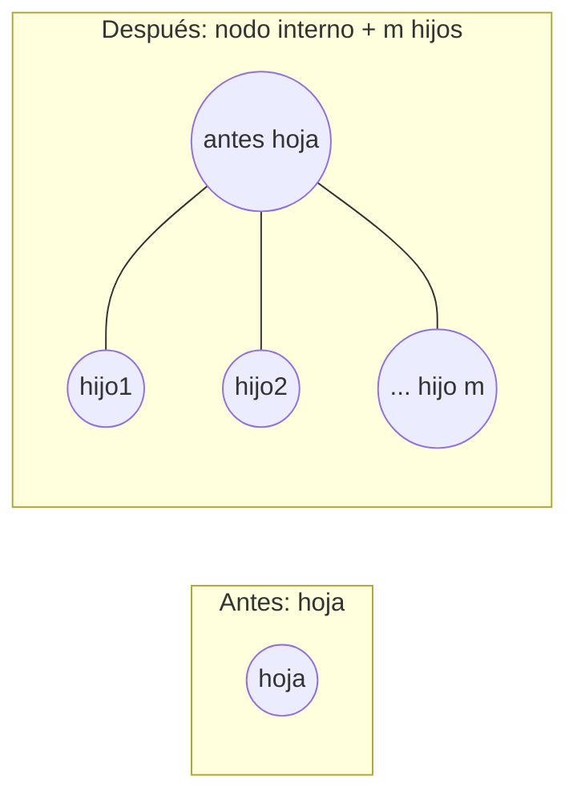

- Los nodos internos suben de $k$ a $k+1$.
- El total de vértices aumenta exactamente en $m$ (los hijos nuevos):
  $$|V_{k+1}| = |V_k| + m$$
- Sustituyendo la hipótesis inductiva $|V_k| = mk+1$:
  $$|V_{k+1}| = (mk+1) + m = mk+m+1 = m(k+1)+1$$

Esto es exactamente la fórmula evaluada en $i=k+1$. Como el caso base se
cumple y el paso inductivo preserva la fórmula, queda demostrada para
cualquier $i$. $\blacksquare$

### Fórmulas derivadas (en función del número de hojas $l$)

Partiendo de $n=i+l$ y de $|V|=mi+1$ (que son la misma cantidad $n=|V|$),
se igualan:

$$m\cdot i + 1 = i + l$$

Se agrupan las $i$ a un lado:

$$m\cdot i - i = l - 1 \quad\Rightarrow\quad i(m-1) = l-1$$

$$\boxed{i = \dfrac{l-1}{m-1}}$$

Y sustituyendo de vuelta en $n = i+l$:

$$\boxed{n = \dfrac{l-1}{m-1} + l = \dfrac{ml-1}{m-1}}$$

---

## 5. Cota de hojas: $l \le m^h$

**Enunciado:** en un árbol $m$-ario de altura $h$, el número de hojas
$l$ nunca puede superar $m^h$.

### Demostración por inducción sobre la altura

**Caso base ($h=0$):** un árbol de altura 0 es un solo nodo (la raíz),
que automáticamente es una hoja: $l=1$. Evaluando: $m^0=1$. Como
$1 \le 1$, se cumple. ✅

**Hipótesis inductiva:** se asume que para cualquier árbol de altura $k$,
su cantidad de hojas cumple $l_k \le m^k$.

**Paso inductivo ($h=k+1$):** imagina un árbol $T$ de altura $k+1$. Si
se quita la raíz, quedan como máximo $m$ subárboles (uno por cada hijo
de la raíz), y cada uno de ellos tiene, a lo más, altura $k$:

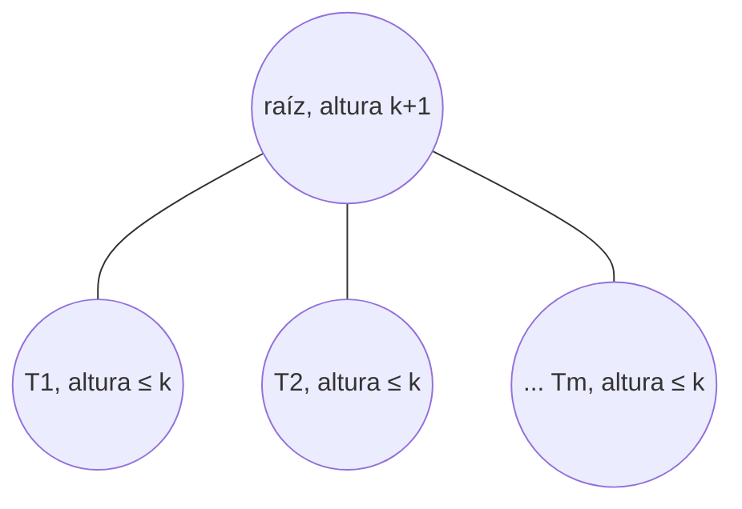

Por hipótesis inductiva, cada subárbol $T_i$ tiene, como mucho, $m^k$
hojas. El total de hojas del árbol completo es la suma de las hojas de
todos sus subárboles:

$$l = l_{T_1} + l_{T_2} + \dots + l_{T_m} \le \underbrace{m^k + m^k + \dots + m^k}_{m \text{ veces}} = m \cdot m^k = m^{k+1}$$

Por lo tanto $l \le m^{k+1}$, que es justo la fórmula evaluada en
$h=k+1$. $\blacksquare$

---

## 6. Camino único entre dos vértices de un árbol

**Enunciado:** si $a,b$ son vértices distintos de un árbol $A$, existe
un **único** camino que los conecta.

Se demuestran dos cosas por separado: que el camino **existe**, y que es
**el único** posible.

### Existencia

- **Premisa:** por definición, un árbol es un grafo **conexo**.
- **Consecuencia:** la definición de grafo conexo dice que para
  cualquier par de vértices distintos siempre se puede encontrar una
  secuencia de aristas que los conecte.
- **Conclusión:** el camino entre $a$ y $b$ existe.

### Unicidad (por reducción al absurdo)

Se supone lo **contrario** de lo que se quiere probar, y se llega a una
contradicción:

- **Suposición:** existen **dos** caminos diferentes, $C_1$ y $C_2$, que
  conectan a $a$ con $b$.

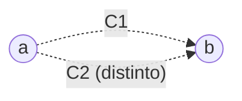

- Ambos caminos comienzan juntos en $a$ y terminan juntos en $b$. Como
  son diferentes, en algún punto intermedio tienen que **separarse**, y
  como ambos llegan al mismo destino, en algún momento posterior tienen
  que **volver a juntarse**.
- **La contradicción:** si recorres $C_1$ desde el punto de separación
  hasta el punto de unión, y luego regresas al inicio usando $C_2$,
  acabas de recorrer una trayectoria **cerrada sin repetir aristas** —
  es decir, un **ciclo**.
- Pero por definición, un árbol es **acíclico** (nunca puede tener
  ciclos). Contradicción.

**Conclusión:** la suposición de que existían dos caminos distintos es
falsa. El camino entre $a$ y $b$ es **único**. $\blacksquare$

---

## 7. Longitud de camino externo (LCE)

**Definición:** la longitud de camino externo de un árbol extendido es
la suma de las distancias (en aristas) desde la raíz hasta cada uno de
los **nodos especiales** (u hojas especiales):

$$LCE = \sum_{i=0}^{h} ne_i \cdot i$$

donde $i$ es el nivel actual, $h$ la altura máxima del árbol, y $ne_i$
la cantidad de nodos especiales en el nivel $i$.

### Demostración por inducción (sobre la altura $h$)

**Caso base ($h=0$):** el árbol más pequeño posible es un solo nodo raíz
que a su vez es un nodo especial: $ne_0=1$. La distancia de la raíz a sí
misma es $0$ aristas, así que $LCE=0$ manualmente. Evaluando la fórmula:

$$LCE = \sum_{i=0}^{0} ne_i \cdot i = ne_0 \cdot 0 = 1 \cdot 0 = 0$$

Ambos valores coinciden. ✅

**Hipótesis inductiva:** para un árbol de altura $k$, se cumple
$LCE_k = \sum_{i=0}^{k} ne_i \cdot i$.

**Paso inductivo ($h=k+1$):** al crecer el árbol de altura $k$ a $k+1$,
los nodos especiales de los niveles $0$ a $k-1$ no cambian. Aparece un
nuevo nivel $k+1$ con $ne_{k+1}$ nodos especiales nuevos, cada uno a
distancia $k+1$ de la raíz. El nuevo total es el valor anterior más el
aporte del nivel nuevo:

$$LCE_{k+1} = LCE_k + \big(ne_{k+1}\cdot(k+1)\big) = \left(\sum_{i=0}^{k} ne_i\cdot i\right) + ne_{k+1}\cdot(k+1) = \sum_{i=0}^{k+1} ne_i\cdot i$$

que es exactamente la fórmula evaluada en $h=k+1$. $\blacksquare$

### Ejemplo numérico

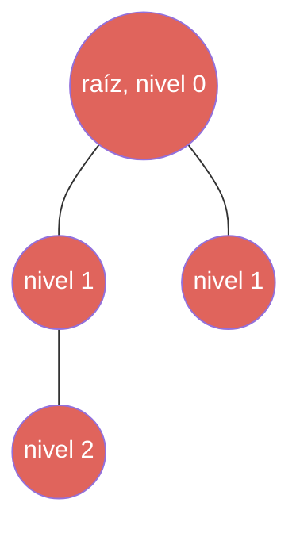

Si **todos** los nodos son especiales: $ne_0=1$ (la raíz), $ne_1=2$,
$ne_2=1$. Aplicando la fórmula:

$$LCE = (1\cdot 0) + (2\cdot 1) + (1\cdot 2) = 0+2+2 = 4$$

---

## 8. Recorridos: Preorden, Inorden, Posorden

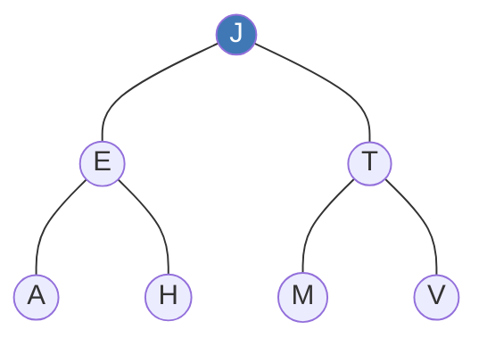

- **Preorden** (raíz → izquierda → derecha): visita la raíz primero,
  desciende por la izquierda hasta donde se pueda, y cuando ya no puede
  seguir, se mueve a la derecha y repite.
  $$\text{Preorden} = J\text{-}E\text{-}A\text{-}H\text{-}T\text{-}M\text{-}V$$

- **Inorden** (izquierda → raíz → derecha): visita primero el subárbol
  izquierdo por completo, luego la raíz, y por último el subárbol
  derecho.
  $$\text{Inorden} = A\text{-}E\text{-}H\text{-}J\text{-}M\text{-}T\text{-}V$$

- **Posorden** (izquierda → derecha → raíz): visita primero el subárbol
  izquierdo, luego el derecho, y **al final** la raíz.
  $$\text{Posorden} = A\text{-}H\text{-}E\text{-}M\text{-}V\text{-}T\text{-}J$$

---

## 9. Árbol de Búsqueda Binaria (ABB)

**Regla de oro:** para **cualquier** nodo del árbol se deben cumplir
estas tres condiciones:

- **Lado izquierdo menor:** todos los nodos del subárbol izquierdo
  tienen un valor **menor** que el del nodo.
- **Lado derecho mayor:** todos los nodos del subárbol derecho tienen un
  valor **mayor** que el del nodo.
- **Propiedad hereditaria:** esta regla se aplica exactamente igual a
  **cada** subnodo del árbol, no solo a la raíz.

### Ejemplo — construcción insertando 18, 23, 22, 19, 29, 24, 31

Cada número nuevo entra comparando desde la raíz: si es menor, va a la
izquierda; si es mayor, a la derecha; y se repite en cada nodo hasta
encontrar un espacio libre.

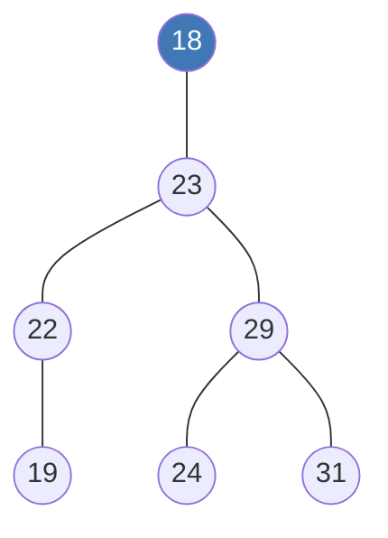

> *(Nota: un ABB estándar no admite claves duplicadas; por eso esta
> reconstrucción usa la secuencia sin repetir el 19 y el 22 que aparecían
> dos veces en el material original.)*

---

## 10. Eliminación en un ABB

Hay **tres casos**, según cuántos hijos tenga el nodo a eliminar:

1. **Nodo hoja (sin hijos):** se elimina directamente.
2. **Nodo con un hijo:** el hijo pasa a ocupar el lugar del nodo
   eliminado.
3. **Nodo con dos hijos:** se reemplaza por su **sucesor inorden** (el
   valor más pequeño de su subárbol derecho) o por su **predecesor
   inorden** (el valor más grande de su subárbol izquierdo).

### Árbol inicial

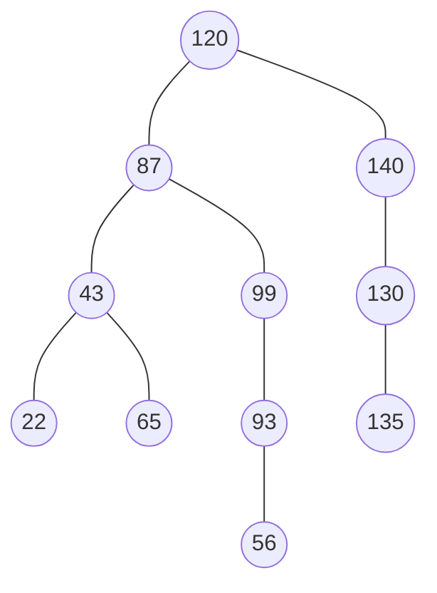

### Paso 1 — Eliminar 22

El 22 es una **hoja** (no tiene hijos). Se elimina directamente, sin
afectar al resto del árbol.

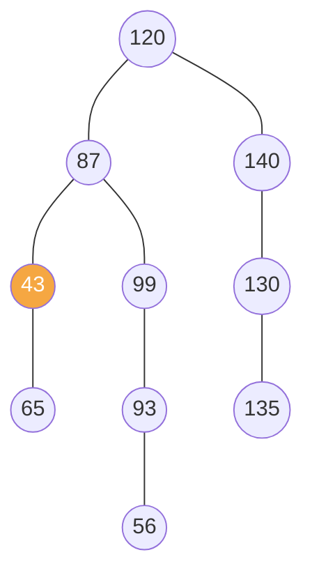

### Paso 2 — Eliminar 99

El 99 tiene **un solo hijo**: 93. Por la regla del ABB, el padre (87)
deja de apuntar a 99 y apunta directamente a 93.

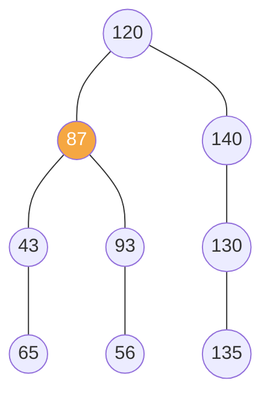

### Paso 3 — Eliminar 87

El 87 tiene **dos hijos** (43 y 93). Se reemplaza por su **sucesor
inorden**: el valor más pequeño del subárbol derecho (93). Como 93 no
tiene hijo izquierdo, el sucesor es el propio 93; se copia su valor a la
posición de 87 y se elimina el 93 original (que ahora quedó duplicado).

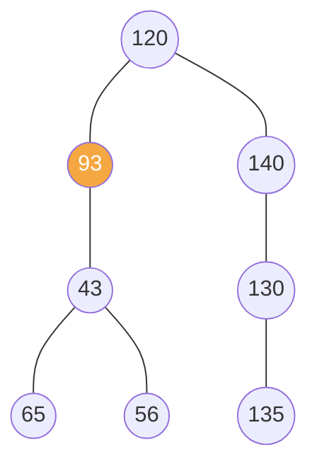

> Nota: el 56, que colgaba de 93, ahora es hijo izquierdo del 43 (era el
> único descendiente restante del antiguo subárbol derecho de 43,
> reacomodado según la regla ABB — menor que 65, mayor que 43).

### Paso 4 — Eliminar 120 (la raíz)

El 120 también tiene **dos hijos** (93 y 140). Se busca el sucesor: el
valor más pequeño del subárbol derecho, que es 130. Como 130 sí tiene un
hijo (135), primero se reacomoda ese hijo antes de mover 130 a la raíz.

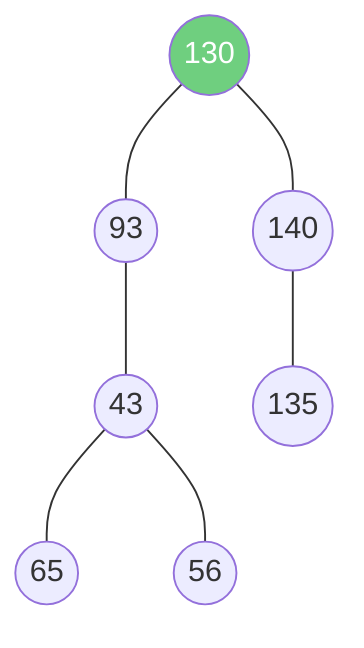

**Árbol final** tras las 4 eliminaciones.

---

## 11. Factor de equilibrio (FE) y árboles AVL

**Definición:** el factor de equilibrio de un nodo $T$ se calcula como
la altura de su subárbol derecho menos la altura de su subárbol
izquierdo:

$$FE = H_{SD} - H_{SI}$$

Un árbol **AVL** exige que $FE \in \{-1, 0, 1\}$ en **todos** sus nodos;
si alguno se sale de ese rango, hay que **rotar** para volver a
equilibrarlo.

### Regla de oro de la inserción

Cada vez que llega un número nuevo, se compara desde la raíz:

- Si es **menor**, se camina hacia la **izquierda**.
- Si es **mayor**, se camina hacia la **derecha**.

Se repite en cada nodo hasta encontrar un lugar vacío, donde se inserta.

### Las 4 rotaciones

#### 11.1 Rotación simple a la derecha (caso Izquierda-Izquierda)

**Cuándo ocurre:** el nodo desbalanceado $A$ tiene $FE=-2$, y el
desequilibrio viene de su hijo izquierdo $B$ (también cargado hacia la
izquierda) — los tres nodos forman una línea recta hacia la izquierda.

**Cómo funciona la rotación (mecánica):**

1. $B$ (el hijo izquierdo de $A$) sube a ocupar el lugar de $A$.
2. $A$ baja y se convierte en el **hijo derecho** de $B$.
3. Si $B$ ya tenía un hijo derecho antes de rotar, ese hijo pasa a ser el
   nuevo **hijo izquierdo** de $A$ (para no perderlo — por la regla del
   ABB, ese subárbol tenía valores entre $B$ y $A$, así que ahí sigue
   encajando).

**Diagrama genérico:**

**ANTES — desbalanceado (inclinado a la izquierda):**

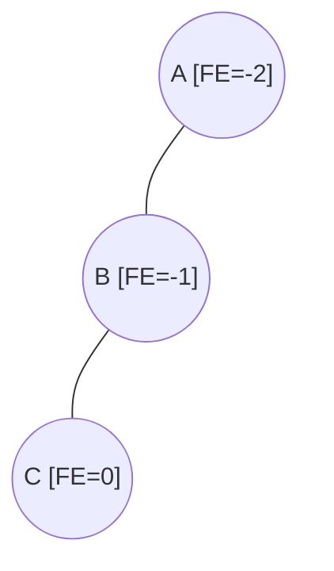

**DESPUÉS — balanceado:**

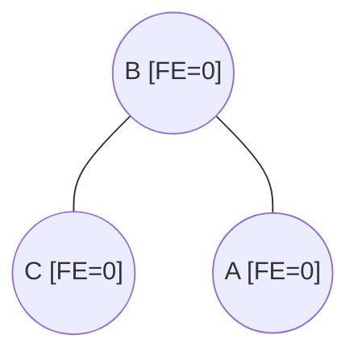

**Ejemplo — insertando 50, 30, 70, 20, 40, 10 en ese orden:**

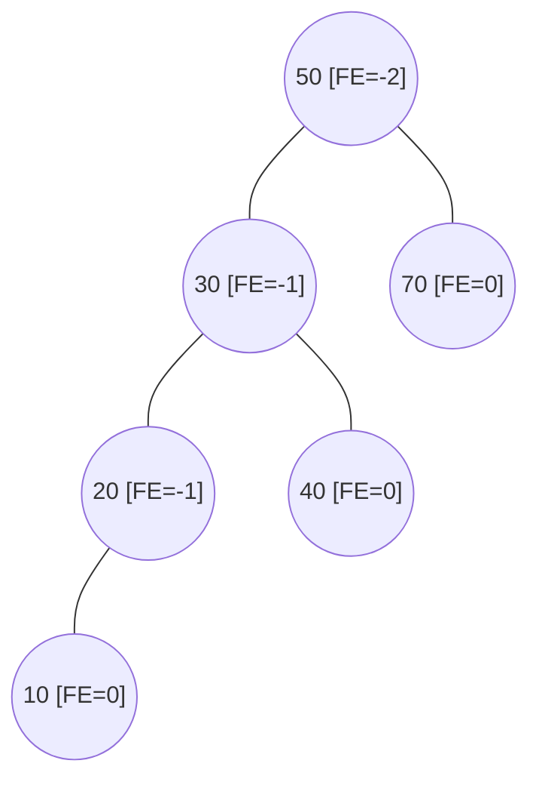

Se detecta $FE=-2$ en la raíz (50): su hijo izquierdo (30) también está
cargado a la izquierda, y a su vez el hijo izquierdo de 30 (20) también
— la cadena $50\to30\to20\to10$ (marcada hacia la izquierda) confirma el
caso Izquierda-Izquierda. Se rota a la derecha sobre 50: **30** sube a
la raíz, **50** baja como su hijo derecho, y el hijo derecho que 30 ya
tenía (**40**) se reubica como el nuevo hijo **izquierdo** de 50 (porque
$30<40<50$, ahí es donde le corresponde por la regla del ABB):

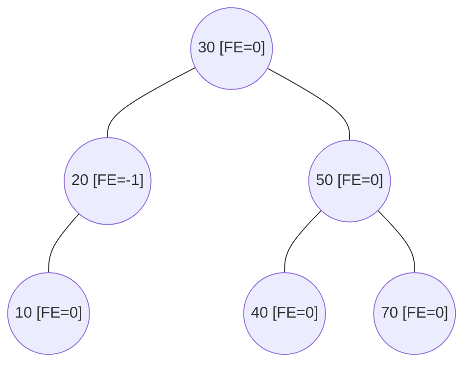

*(fíjate cómo 40 "viaja" de ser hijo derecho de 30 a ser hijo izquierdo
de 50 — ese es el detalle que no se ve en el ejemplo mínimo de 3 nodos)*

#### 11.2 Rotación simple a la izquierda (caso Derecha-Derecha)

**Cuándo ocurre:** el nodo desbalanceado $A$ tiene $FE=+2$, y el
desequilibrio viene de su hijo derecho — línea recta hacia la derecha.

**Cómo funciona la rotación (mecánica, espejo de la anterior):**

1. El hijo derecho de $A$ sube a ocupar su lugar.
2. $A$ baja y se convierte en el **hijo izquierdo** del que subió.
3. Si el que subió ya tenía un hijo izquierdo, ese hijo pasa a ser el
   nuevo **hijo derecho** de $A$.

**Diagrama genérico:**

**ANTES — desbalanceado (inclinado a la derecha):**

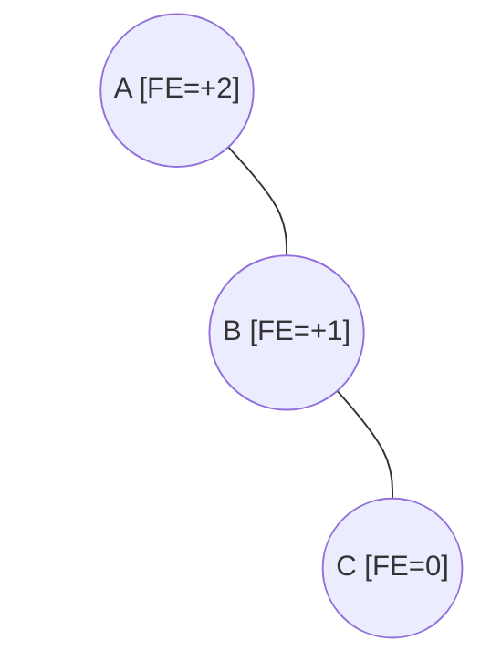

**DESPUÉS — balanceado:**

```mermaid
graph TD
    d1(("B [FE=0]")) --- d2(("A [FE=0]"))
    d1 --- d3(("C [FE=0]"))
```

**Ejemplo — insertando 50, 70, 30, 80, 60, 90 en ese orden:**

```mermaid
graph TD
    g1(("50 [FE=+2]")) --- g2(("30 [FE=0]"))
    g1 --- g3(("70 [FE=+1]"))
    g3 --- g4(("60 [FE=0]"))
    g3 --- g5(("80 [FE=+1]"))
    g5 --- sp1[" "]:::invis
    g5 --- g6(("90 [FE=0]"))

    classDef invis fill:none,stroke:none,color:none
    linkStyle 4 stroke:none;
```

Se detecta $FE=+2$ en la raíz (50): su hijo derecho (70) también está
cargado a la derecha, y a su vez el hijo derecho de 70 (80) también — la
cadena $50\to70\to80\to90$ (marcada hacia la derecha) confirma el caso
Derecha-Derecha. Se rota a la izquierda sobre 50: **70** sube a la
raíz, **50** baja como su hijo izquierdo, y el hijo izquierdo que 70 ya
tenía (**60**) se reubica como el nuevo hijo **derecho** de 50 (porque
$50<60<70$):

```mermaid
graph TD
    h1(("70 [FE=0]")) --- h2(("50 [FE=0]"))
    h1 --- h3(("80 [FE=+1]"))
    h2 --- h4(("30 [FE=0]"))
    h2 --- h5(("60 [FE=0]"))
    h3 --- h6[" "]:::invis
    h3 --- h7(("90 [FE=0]"))

    classDef invis fill:none,stroke:none,color:none
    linkStyle 4 stroke:none;
```

*(60 "viaja" de ser hijo izquierdo de 70 a ser hijo derecho de 50 — la
misma idea que en el caso anterior, en espejo)*

#### 11.3 Rotación doble Izquierda-Derecha (caso ID)

**Cuándo ocurre:** un "zigzag" — el hijo izquierdo de $A$ está cargado
hacia la **derecha** (signos de FE contrarios entre padre e hijo).

**Cómo funciona la rotación (dos pasos):**

1. **Primero**, una rotación simple a la **izquierda** sobre el hijo
   izquierdo de $A$ — esto "endereza" el zigzag convirtiéndolo en una
   línea recta (caso Izquierda-Izquierda).
2. **Luego**, una rotación simple a la **derecha** sobre $A$, igual que
   en la sección 11.1. El "nieto" (el nodo que estaba en medio del
   zigzag) termina siendo la nueva raíz del subárbol.

**Diagrama genérico:**

**ESTADO 1: ANTES (Zigzag desbalanceado: primero izquierda, luego derecha):**

```mermaid
graph TD
    A(("A [FE=-2]")) --- B(("B [FE=+1]"))
    A --- sp1[" "]:::invis
    B --- sp2[" "]:::invis
    B --- C(("C [FE=0]"))

    classDef invis fill:none,stroke:none,color:none
    linkStyle 1,2 stroke:none;
```
**ESTADO 2: INTERMEDIO (Tras rotación simple izquierda sobre B):**

```mermaid
graph TD
    A1(("A [FE=-2]")) --- C1(("C [FE=-1]"))
    A1 --- sp1[" "]:::invis
    C1 --- B1(("B [FE=0]"))
    C1 --- sp2[" "]:::invis

    classDef invis fill:none,stroke:none,color:none
    linkStyle 1,3 stroke:none;
```


**ESTADO 3: DESPUÉS (Tras rotación simple derecha sobre A):**

```mermaid
graph TD
    C2(("C [FE=0]")) --- B2(("B [FE=0]"))
    C2 --- A2(("A [FE=0]"))
```

**Ejemplo — insertando 50, 20, 70, 10, 30, 25 en ese orden:**

1. ANTES (Zigzag en el nodo 20 y 30 con inserción de 25):

```mermaid
graph TD
    i1(("50 [FE=-2]")) --- i2(("20 [FE=+1]"))
    i1 --- i3(("70 [FE=0]"))
    i2 --- i4(("10 [FE=0]"))
    i2 --- i5(("30 [FE=-1]"))
    i5 --- i6(("25 [FE=0]"))
    i5 --- sp1[" "]:::invis

    classDef invis fill:none,stroke:none,color:none
    linkStyle 5 stroke:none;
```

2. INTERMEDIO (Rotación izquierda sobre 20, el nodo 30 sube y se alinea):

```mermaid
graph TD
    int1(("50 [FE=-2]")) --- int2(("30 [FE=-1]"))
    int1 --- int3(("70 [FE=0]"))
    int2 --- int4(("20 [FE=0]"))
    int2 --- sp1[" "]:::invis
    int4 --- int5(("10 [FE=0]"))
    int4 --- int6(("25 [FE=0]"))

    classDef invis fill:none,stroke:none,color:none
    linkStyle 3 stroke:none;
```

3. DESPUÉS (Rotación derecha sobre 50, el nodo 30 pasa a ser la nueva raíz):
   
```mermaid
graph TD
    j1(("30 [FE=0]")) --- j2(("20 [FE=0]"))
    j1 --- j3(("50 [FE=+1]"))
    j2 --- j4(("10 [FE=0]"))
    j2 --- j5(("25 [FE=0]"))
    j3 --- sp1[" "]:::invis
    j3 --- j6(("70 [FE=0]"))

    classDef invis fill:none,stroke:none,color:none
    linkStyle 4 stroke:none;
```
*(el detalle clave que el ejemplo mínimo no muestra: 25 no desaparece ni
se queda "flotando" — se reengancha nuevamente siguiendo la regla de menores
a la izquierda y mayores a la derecha)*


#### 11.4 Rotación doble Derecha-Izquierda (caso DI)

**Cuándo ocurre:** zigzag en sentido contrario — el hijo derecho de $A$
está cargado hacia la **izquierda**.

**Cómo funciona la rotación (dos pasos, espejo del caso anterior):**

1. **Primero**, una rotación simple a la **derecha** sobre el hijo
   derecho de $A$ — endereza el zigzag (queda como caso
   Derecha-Derecha).
2. **Luego**, una rotación simple a la **izquierda** sobre $A$, igual
   que en la sección 11.2. El "nieto" del zigzag termina siendo la
   nueva raíz.

**Diagrama genérico:**

**ESTADO 1: ANTES (Zigzag desbalanceado: primero derecha, luego izquierda):**

```mermaid
graph TD
    A(("A [FE=+2]")) --- sp1[" "]:::invis
    A --- B(("B [FE=-1]"))
    B --- C(("C [FE=0]"))
    B --- sp2[" "]:::invis

    classDef invis fill:none,stroke:none,color:none
    linkStyle 0,3 stroke:none;
```
**ESTADO 2: INTERMEDIO (Tras rotación simple derecha sobre B):**

```mermaid
graph TD
    A1(("A [FE=+2]")) --- sp1[" "]:::invis
    A1 --- C1(("C [FE=+1]"))
    C1 --- sp2[" "]:::invis
    C1 --- B1(("B [FE=0]"))

    classDef invis fill:none,stroke:none,color:none
    linkStyle 0,2 stroke:none;
```


**ESTADO 3: DESPUÉS (Tras rotación simple izquierda sobre A):**

```mermaid
graph TD
    C2(("C [FE=0]")) --- A2(("A [FE=0]"))
    C2 --- B2(("B [FE=0]"))
```

**Ejemplo — insertando 50, 80, 20, 90, 70, 75 en ese orden:**

1. ANTES (Zigzag provocado por la inserción de 75):

```mermaid
graph TD
    k1(("50 [FE=+2]")) --- k2(("20 [FE=0]"))
    k1 --- k3(("80 [FE=-1]"))
    k3 --- k4(("70 [FE=+1]"))
    k3 --- k5(("90 [FE=0]"))
    k4 --- sp1[" "]:::invis
    k4 --- k6(("75 [FE=0]"))

    classDef invis fill:none,stroke:none,color:none
    linkStyle 4 stroke:none;
```

2. INTERMEDIO (Rotación derecha sobre 80, el nodo 70 sube alineando la rama derecha):

```mermaid
graph TD
    m1(("50 [FE=+2]")) --- m2(("20 [FE=0]"))
    m1 --- m3(("70 [FE=+1]"))
    m3 --- sp1[" "]:::invis
    m3 --- m4(("80 [FE=0]"))
    m4 --- m5(("75 [FE=0]"))
    m4 --- m6(("90 [FE=0]"))

    classDef invis fill:none,stroke:none,color:none
    linkStyle 2 stroke:none;
```

3. DESPUÉS (Rotación izquierda sobre 50, el nodo 70 corona el subárbol balanceado):


```mermaid
graph TD
    l1(("70 [FE=0]")) --- l2(("50 [FE=-1]"))
    l1 --- l3(("80 [FE=0]"))
    l2 --- l4(("20 [FE=0]"))
    l2 --- sp1[" "]:::invis
    l3 --- l5(("75 [FE=0]"))
    l3 --- l6(("90 [FE=0]"))

    classDef invis fill:none,stroke:none,color:none
    linkStyle 3 stroke:none;
```

*(igual que en el caso anterior: 75 no se pierde, se reubica como hijo
izquierdo de 80 en el primer paso)*

---

## 12. Ejercicio integrador

**Enunciado:**
a) Crear un ABB con las etiquetas 35, 40, 20, 15.
b) Insertar 9.
c) Calcular el factor de equilibrio en cada nodo.
d) Equilibrar el árbol con la rotación que corresponda.
e) Calcular el factor de equilibrio del árbol resultante.

### a) Construcción del ABB

Insertando en orden (35 es la raíz; 40 es mayor → derecha; 20 es menor →
izquierda; 15 es menor que 35 y menor que 20 → izquierda de 20):

```mermaid
graph TD
    35((35)) --- 20((20))
    35 --- 40((40))
```

El elemento 15 es menor que 35 y menor que 20, por lo que se ubica como hijo izquierdo de 20. Añadimos un nodo fantasma a la derecha de 20 para evitar que el 15 quede centrado.

```mermaid
graph TD
    35((35)) --- 20((20))
    35 --- 40((40))
    20 --- 15((15))
    20 --- sp1[" "]:::invis

    classDef invis fill:none,stroke:none,color:none
    linkStyle 3 stroke:none;
```

### b) Insertar 9

$9 < 35$, $9 < 20$, $9 < 15$ → queda como hijo izquierdo de 15:

```mermaid
graph TD
    35((35)) --- 20((20))
    35 --- 40((40))
    20 --- 15((15))
    20 --- sp1[" "]:::invis
    15 --- 9((9))
    15 --- sp2[" "]:::invis

    classDef invis fill:none,stroke:none,color:none
    linkStyle 3,5 stroke:none;
```

### c) Factor de equilibrio (antes de rotar)

| Nodo | $H_{SI}$ | $H_{SD}$ | $FE = H_{SD}-H_{SI}$ |
|---|---|---|---|
| 9 | −1 (vacío) | −1 (vacío) | 0 |
| 15 | 0 (nodo 9) | −1 (vacío) | −1 |
| 20 | 1 (subárbol 15-9) | −1 (vacío) | −2  |
| 40 | −1 | −1 | 0 |
| **35** | 2 (subárbol 20-15-9) | 0 (nodo 40) | **−2 ** |

Los nodos **20** y **35** están desbalanceados ($|FE|>1$). Como el
desequilibrio viene de una cadena recta hacia la izquierda
($35\to20\to15\to9$), es un caso **Izquierda-Izquierda**.

### d) Equilibrar con rotación simple a la derecha

> **Aclaración:** por el desequilibrio detectado (Izquierda-Izquierda,
> $FE=-2$ en el nodo 35), la rotación que corrige esto técnicamente es
> una **rotación simple a la derecha** sobre 35 (no "a la izquierda").
> Se aplica sobre el nodo más alto desbalanceado:

```mermaid
graph TD
    20((20)) --- 15((15))
    20 --- 35((35))
    15 --- 9((9))
    15 --- sp1[" "]:::invis
    35 --- sp2[" "]:::invis
    35 --- 40((40))

    classDef invis fill:none,stroke:none,color:none
    linkStyle 3,4 stroke:none;
```

$20$ sube a ocupar la raíz del subárbol, $35$ baja para ser su hijo
derecho (conservando a $40$ como su propio hijo derecho), y $15$ (con su
hijo $9$) se queda como hijo izquierdo de $20$.

### e) Factor de equilibrio del árbol resultante

| Nodo | $H_{SI}$ | $H_{SD}$ | $FE$ |
|---|---|---|---|
| 9 | −1 | −1 | 0 |
| 40 | −1 | −1 | 0 |
| 15 | 0 (nodo 9) | −1 | −1 |
| 35 | −1 | 0 (nodo 40) | 1 |
| **20** | 1 (subárbol 15-9) | 1 (subárbol 35-40) | **0**  |

Todos los nodos quedan con $FE \in \{-1,0,1\}$: **el árbol ya es AVL
válido**.
