# Autómatas y lenguajes formales — Guía a detalle

INCOMPLETO

---

## 1. Máquina de estado finito — concepto

Una máquina de estado finito es un sistema que **lee una entrada símbolo
por símbolo**, cambia de estado según lo que lee, y al final acepta o
rechaza la cadena completa según en qué estado terminó.

- **DFA (Autómata Finito Determinista):** desde cada estado, para cada
  símbolo, hay **exactamente una** transición posible.
- **NFA (Autómata Finito No Determinista):** desde un estado, para un
  mismo símbolo, puede haber **varias** transiciones posibles (o
  ninguna) — el autómata "se ramifica" y explora todos los caminos a la
  vez.

Ambos reconocen exactamente la misma clase de lenguajes (los
**regulares**), pero el NFA suele ser más fácil de diseñar, mientras que
el DFA es más fácil de **implementar** en código (no hay ambigüedad de
qué camino seguir).

**Cómo se lee un autómata (idea general):** se arranca en el estado
inicial y se va leyendo la cadena símbolo por símbolo, de izquierda a
derecha, moviéndose de estado en estado. Al final, si se terminó en un
estado marcado como **final**, la cadena se acepta:

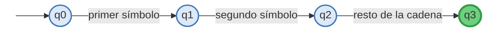

*(q0 es el estado inicial; q3, en verde, es el estado final — si la
cadena termina ahí, se acepta)*

---

## 2. Ejemplo: NFA que detecta palabras que terminan en "aba"

**Idea de diseño:** el autómata se queda "dando vueltas" en el estado
inicial mientras no vea nada especial, y en paralelo intenta emparejar
el sufijo `aba`.

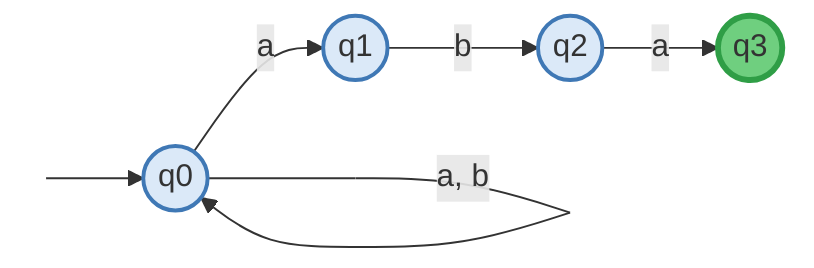

- $q_0$: estado inicial, todavía no ha visto nada del sufijo.
- $q_1$: acaba de ver una `a` (posible inicio de "aba").
- $q_2$: ya vio `a`, `b`.
- $q_3$ (**final**): ya vio `a`, `b`, `a` — la cadena termina en "aba".

Como es un NFA, desde $q_0$ hay **dos** transiciones con `a` (una que se
queda en $q_0$ y otra que avanza a $q_1$) — el autómata prueba ambas
"apuestas" en simultáneo, y acepta si **alguna** de ellas termina en
$q_3$.

---

## 3. Conversión NFA → DFA por el método de subconjuntos

**Idea:** un DFA equivalente se construye tratando cada **conjunto** de
estados posibles del NFA como un solo estado del DFA nuevo (por eso
también se llama *construcción de subconjuntos* o *powerset
construction*).

### Problema

NFA con estados $S_0,S_1,S_2,S_3$ (siendo $S_1$ y $S_3$ finales) y esta
tabla de transición:

| Estado | $a$ | $b$ |
|---|---|---|
| $S_0$ | $S_2$ | $S_1$ |
| $S_1$ | $\{S_1,S_2\}$ | $S_3$ |
| $S_2$ | $\varnothing$ | $\varnothing$ |
| $S_3$ | $\{S_2,S_3\}$ | $S_2$ |

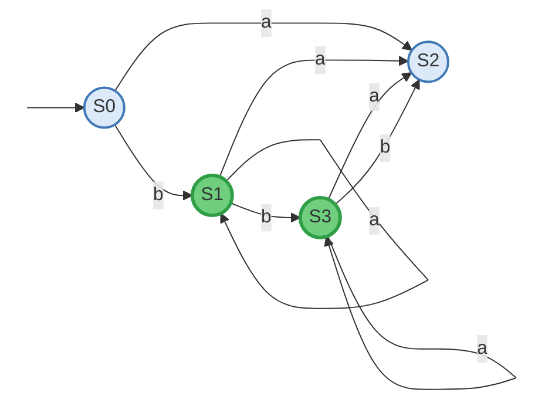

*(en verde, los estados finales $S_1$ y $S_3$)*

### Resolución — construcción de subconjuntos completa

Se parte del conjunto $\{S_0\}$ y se van generando nuevos estados del
DFA cada vez que aparece una combinación nueva:

| Estado del DFA | con $a$ | con $b$ | ¿Es final? |
|---|---|---|---|
| $\{S_0\}$ (inicial) | $\{S_2\}$ | $\{S_1\}$ | No |
| $\{S_2\}$ | $\varnothing$ | $\varnothing$ | No |
| $\{S_1\}$ | $\{S_1,S_2\}$ | $\{S_3\}$ | **Sí** (tiene $S_1$) |
| $\{S_1,S_2\}$ | $\{S_1,S_2\}$ | $\{S_3\}$ | **Sí** (tiene $S_1$) |
| $\{S_3\}$ | $\{S_2,S_3\}$ | $\{S_2\}$ | **Sí** (tiene $S_3$) |
| $\{S_2,S_3\}$ | $\{S_2,S_3\}$ | $\{S_2\}$ | **Sí** (tiene $S_3$) |
| $\varnothing$ (trampa) | $\varnothing$ | $\varnothing$ | No |

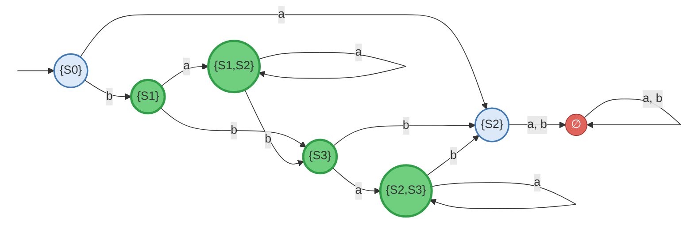

*(en verde, los 4 estados finales; en rojo, el estado trampa $\varnothing$)*

Ya no aparecen conjuntos nuevos (todas las transiciones apuntan a
estados ya listados), así que la conversión terminó: este DFA de 7
estados es **equivalente** al NFA original — acepta exactamente el mismo
lenguaje, pero sin ambigüedad en ninguna transición.

---

## 4. Definición de $F$ para conjuntos de estados (repaso conceptual)

Cuando el NFA está en **varios** estados a la vez (por el
no-determinismo), la función de transición $F$ se extiende tomando la
**unión** de a dónde puede ir cada estado individual:

$$F(\{S_1,S_2\}, a) = F(S_1,a) \cup F(S_2,a)$$

Por ejemplo, si $F(S_1,b)=\{S_1,S_2\}$ y $F(S_2,b)=\varnothing$, entonces
$F(\{S_1,S_2\}, b) = \{S_1,S_2\}\cup\varnothing = \{S_1,S_2\}$. Esta es
exactamente la regla que se usó para construir cada fila de la tabla de
la sección 3.

---

## 5. Autómata que reconoce un número real

**Objetivo:** reconocer números como `-14.25E-20` (signo opcional, parte
entera, punto decimal, parte fraccionaria, y un exponente opcional con
su propio signo).

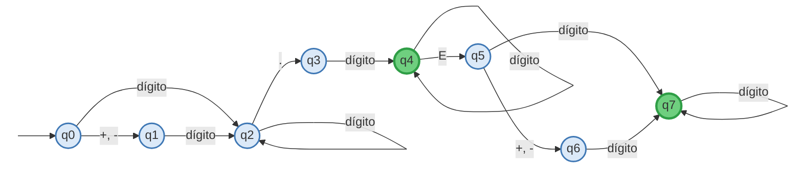

*(en verde, los dos estados finales: q4 acepta sin exponente, q7 acepta
con exponente)*

**Recorrido de `-14.25E-20`:** $q_0 \xrightarrow{-} q_1
\xrightarrow{1} q_2 \xrightarrow{4} q_2 \xrightarrow{.} q_3
\xrightarrow{2} q_4 \xrightarrow{5} q_4 \xrightarrow{E} q_5
\xrightarrow{-} q_6 \xrightarrow{2} q_7 \xrightarrow{0} q_7$ — termina en
$q_7$, que es final. **Cadena aceptada.**

---

## 6. Algoritmo que detecta cadenas del tipo $a^{*}b(ab)^{*}$

```
Lee tamaño
for i = 1 to tamaño
    lee cadena[i]
end for

estado = q0
for i = 1 to tamaño
    if (estado = q0)
        switch(cadena[i])
            case 'a': estado = q0
            case 'b': estado = q1
        end switch
    else if (estado = q1)
        switch(cadena[i])
            case 'a': estado = q2
            case 'b': estado = error
        end switch
    else if (estado = q2)
        switch(cadena[i])
            case 'a': estado = error
            case 'b': estado = q1
        end switch
    end if
end for

if (estado == q1)
    escribir "La cadena es aceptada"
else
    escribir "La cadena no es aceptada"
end if
```

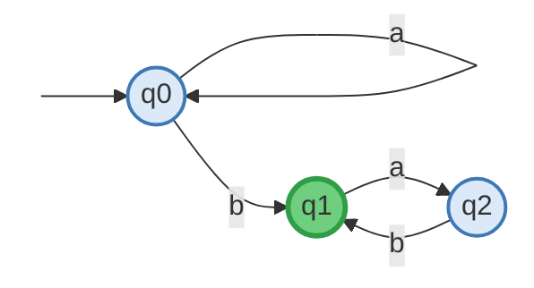

**Trazado con la cadena `aabab`:**

| Paso | Símbolo leído | Estado antes | Estado después |
|---|---|---|---|
| 1 | a | q0 | q0 |
| 2 | a | q0 | q0 |
| 3 | b | q0 | q1 |
| 4 | a | q1 | q2 |
| 5 | b | q2 | q1 |

Termina en $q_1$ (final) → **cadena aceptada**, coincide con el patrón
$a^{*}b(ab)^{*}$: dos "aes" sueltas, luego $b$, luego un bloque $ab$.

---

## 7. Gramática de estructura de frase

Una gramática de estructura de frase (gramática $G$) se define como:

$$G = \{V_n, V_t, S, P\}$$

- **$V_n$:** conjunto finito de símbolos **no terminales** — se pueden
  seguir sustituyendo por otros símbolos.
- **$V_t$:** conjunto finito de símbolos **terminales** — ya no se
  pueden sustituir más (son el resultado final).
- **$S$:** el símbolo especial de **inicio**, siempre pertenece a
  $V_n$; toda derivación arranca desde aquí.
- **$P$:** el conjunto de **reglas de producción**, cada una de la forma
  $W_0 \to W_1$, donde $W_0$ debe contener al menos un símbolo no
  terminal.

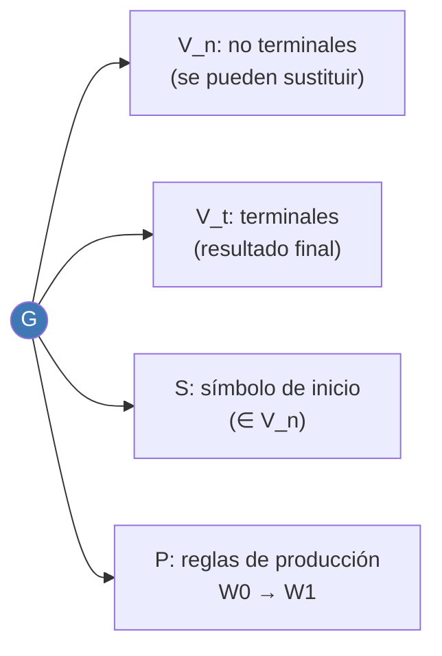

---

## 8. Jerarquía de Chomsky — los 4 tipos de gramática

| Tipo | Nombre | Regla | Autómata equivalente |
|---|---|---|---|
| **0** | Sin restricciones | Lado izq. y der. pueden combinar cualquier cosa (ej. $AB\to a$) | Máquina de Turing |
| **1** | Sensibles al contexto | El lado derecho debe ser **igual o más largo** que el izquierdo ($\alpha \le \beta$) | Autómata linealmente acotado |
| **2** | Libres de contexto | El lado izquierdo es **una sola variable** ($A\to\beta$) | Autómata de pila |
| **3** | Regulares | $A\to a$ o $A\to aB$ (un terminal, opcionalmente seguido de una variable) | Autómata finito (DFA/NFA) |

**Pista visual:** entre menos "libertad" tiene el lado izquierdo de las
reglas, más simple es el autómata que basta para reconocer el lenguaje —
por eso las regulares (las más restringidas) solo necesitan un autómata
finito, y las irrestrictas necesitan toda la potencia de una máquina de
Turing.

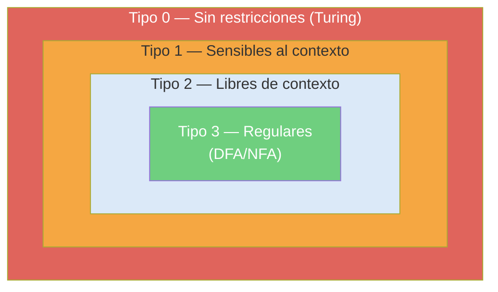

*(cada tipo está contenido dentro del siguiente: todo lenguaje regular
es también libre de contexto, todo libre de contexto es también
sensible al contexto, y así sucesivamente — la jerarquía es de
inclusión, no de reemplazo)*

### Por qué toda gramática regular es reconocida por un DFA

1. Cada **variable** de la gramática se convierte en un **estado** del
   autómata (más un estado final $F$ extra).
2. Cada regla $A \to aB$ se traduce en una flecha de $A$ a $B$ leyendo
   $a$; cada regla $A \to a$ se traduce en una flecha de $A$ al estado
   final $F$ leyendo $a$.
3. Esto construye directamente un **NFA** (porque una variable podría
   tener varias reglas para el mismo símbolo). Por el **Teorema de
   Rabin-Scott** (construcción de subconjuntos, sección 3), todo NFA
   tiene un DFA equivalente.

Como cualquier gramática regular se traduce a un NFA por reglas
mecánicas, y todo NFA se puede convertir a DFA, **toda gramática regular
es reconocida por algún DFA**. $\blacksquare$

---

## 9. Ejemplo completo: de gramática regular a DFA

**Gramática:** $V_N=\{S,A,B\}$, $V_T=\{a,b\}$, símbolo inicial $S$,
reglas:

$$S\to bS,\quad S\to aA,\quad S\to a,\quad A\to aS,\quad B\to b$$

**Traducción regla por regla:**

- $S\to bS$: desde $S$, con $b$, se queda en $S$ (un bucle).
- $S\to aA$: desde $S$, con $a$, se va a $A$.
- $S\to a$: desde $S$, con $a$, la cadena puede **terminar** aquí — se
  necesita un estado final $q_f$.
- $A\to aS$: desde $A$, con $a$, se regresa a $S$.
- $B\to b$: nadie tiene una regla que lleve a $B$ desde $S$ o $A$ — el
  estado $B$ es **inaccesible** y se ignora.

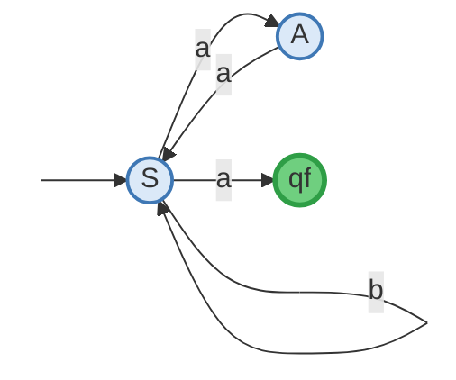

### Conversión a DFA (subconjuntos)

| Estado DFA | con $a$ | con $b$ | ¿Final? |
|---|---|---|---|
| $\{S\}$ (inicial) | $\{A,q_f\}$ | $\{S\}$ | No |
| $\{A,q_f\}$ | $\{S\}$ | $\{S\}$ | **Sí** |

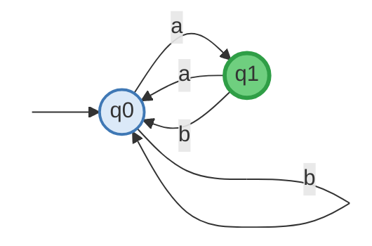

**Lenguaje que acepta:** $L = b^{*}a(ab^{*}a)^{*}$ — cualquier cantidad
de $b$'s, luego una $a$, y de ahí en adelante bloques de "$a$ seguida de
cero o más $b$'s y otra $a$", repetidos las veces que sea.

> **Nota sobre el material original:** en el PDF fuente había un segundo
> ejercicio con las reglas $S\to bB,\ B\to cC,\ B\to cA,\ C\to Bb$
> resuelto a mano de forma poco legible (símbolos y flechas difíciles de
> distinguir con certeza). Preferí no adivinar esos trazos para no
> introducir errores; si tienes una foto más clara de ese ejercicio
> puedo resolverlo con el mismo nivel de detalle que este.

---

## 10. Autómata para un número racional

**Idea general** (sin depender del boceto ilegible del PDF): un número
racional simple se puede modelar como *entero* `/` *entero*, con signo
opcional:

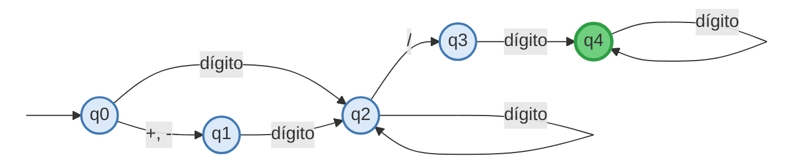

Gramática regular equivalente:

$$S \to +A \mid -A \mid A, \qquad A \to dA \mid d/B, \qquad B \to dB \mid d$$

(donde $d$ representa cualquier dígito 0-9). Esto genera cadenas como
`3/4`, `-12/7`, `+8/1`, etc.

---

## 11. Autómata de una máquina expendedora

**Problema:** máquina que vende gaseosa o agua mineral a \$1.00, acepta
monedas de \$0.25, \$0.50 y \$1.00, y devuelve cambio. Botones **G**
(gaseosa) y **M** (agua mineral).

### Tabla de transición del DFA

| Estado | +\$0.25 | +\$0.50 | +\$1.00 | G | M |
|---|---|---|---|---|---|
| → q0 (\$0.00) | q1 | q2 | q4 | — | — |
| q1 (\$0.25) | q2 | q3 | qC +\$0.25 dev | — | — |
| q2 (\$0.50) | q3 | q4 | qC +\$0.50 dev | — | — |
| q3 (\$0.75) | q4 | qC +\$0.25 dev | qC +\$0.75 dev | — | — |
| **q4 (\$1.00)** | — | — | — | qD→q0 | qD→q0 |
| qC (cambio) | — | — | — | qD→q0 | qD→q0 |

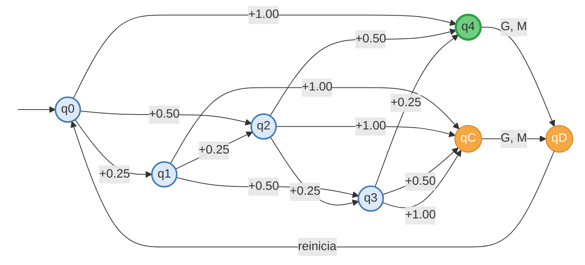

*(verde = acumulado exacto de \$1.00; naranja = estados de tránsito que
dan cambio y entregan la bebida antes de reiniciar en q0)*

**Trazado — el cliente mete \$0.50 y luego \$0.50 más, y pide gaseosa:**

| Paso | Entrada | Estado antes | Estado después | Acción |
|---|---|---|---|---|
| 1 | +\$0.50 | q0 | q2 | acumulado = \$0.50 |
| 2 | +\$0.50 | q2 | q4 | acumulado = \$1.00 exacto |
| 3 | botón G | q4 | qD | entrega gaseosa, sin vuelto |
| 4 | (fin) | qD | q0 | reinicia para el siguiente cliente |

---

## 12. Por qué $L=\{a^n b^{2n} c^{3n} \mid n\ge0\}$ **no** es regular

Este lenguaje exige contar las $a$'s, y comparar simultáneamente que las
$b$'s sean el doble y las $c$'s el triple. Tres razones formales de por
qué esto es imposible para un autómata finito:

1. **Memoria finita:** un autómata finito no tiene memoria auxiliar —
   solo un número fijo de estados. Para verificar "el doble" y "el
   triple" exactos, necesitaría recordar el valor de $n$, que puede
   crecer sin límite ($n\to\infty$), y eso exigiría infinitos estados.
2. **Sincronización múltiple:** incluso un autómata de pila (que sí
   tiene una memoria, la pila) solo puede comparar de forma natural
   **dos** bloques a la vez (por ejemplo, vaciar la pila comparando $a$
   con $b$) — al llegar al tercer bloque ($c$), ya perdió el conteo
   original.
3. **Lema del bombeo:** formalmente, aplicando el lema del bombeo se
   demuestra que este lenguaje no es regular ni libre de contexto. Al
   requerir sincronizar tres bloques dependientes, se clasifica como
   **Tipo 1 — sensible al contexto**, y su reconocimiento requiere un
   autómata linealmente acotado (o, en la práctica, una Máquina de
   Turing).

---

## 13. Ambigüedad en gramáticas

**Definición:** una gramática es **ambigua** si existe al menos una
cadena que se puede construir de **dos o más formas distintas** — es
decir, tiene más de un árbol de derivación posible para la misma cadena.

### Ejemplo 1 — precedencia de operadores

$$E \to E+E \mid E\times E \mid \text{id}$$

Para la cadena `id + id * id`:

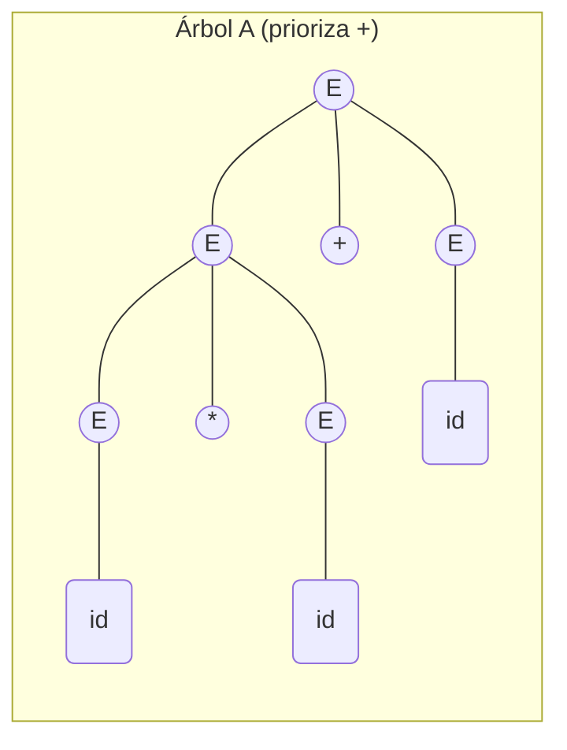


**Sustentación:** el Árbol A agrupa como $(id+id)\times id$ y el Árbol B
agrupa como $id+(id\times id)$ — dos resultados matemáticos distintos
para la misma cadena. La gramática no define ninguna regla de
precedencia entre `+` y `*`, así que es ambigua.

### Ejemplo 2 — crecimiento por ambos extremos

$$S \to aS \mid Sa \mid a$$

Para la cadena `aaa`:

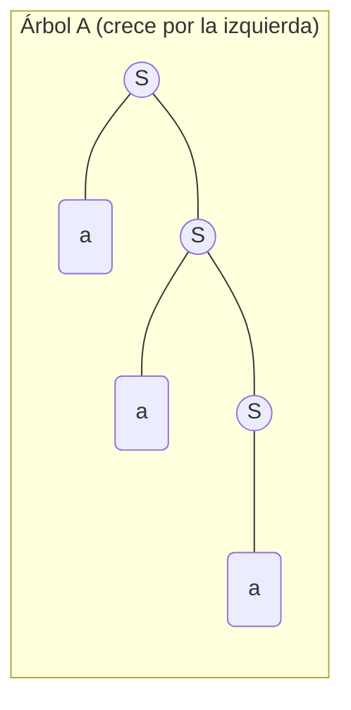

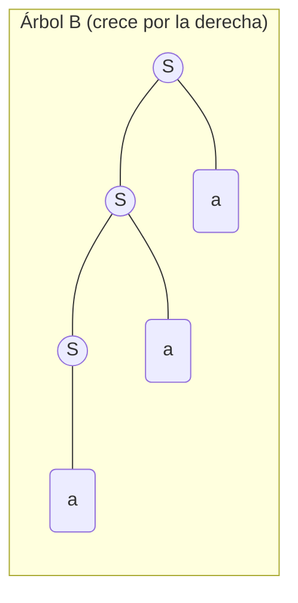

**Sustentación:** ambas ramas procesan exactamente los mismos caracteres
finales (`aaa`), pero el **orden** en que las variables se desglosan es
distinto, produciendo dos árboles de análisis sintáctico independientes.

### Ejemplo 3 — variable duplicada en medio

$$S \to aSb \mid SS \mid ab$$

Para la cadena `abab`:

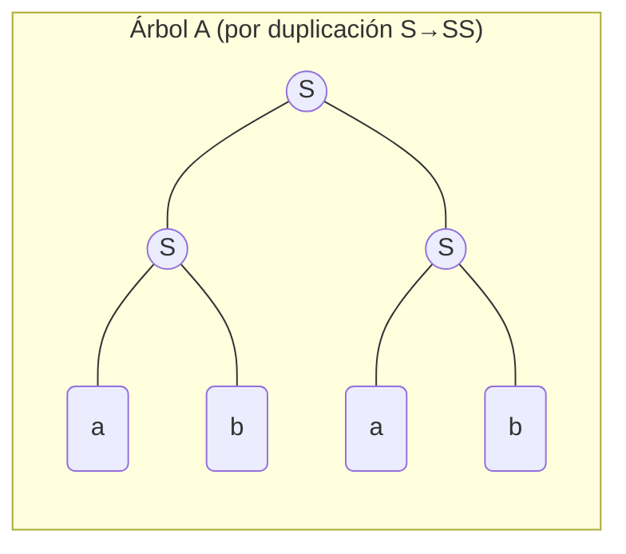

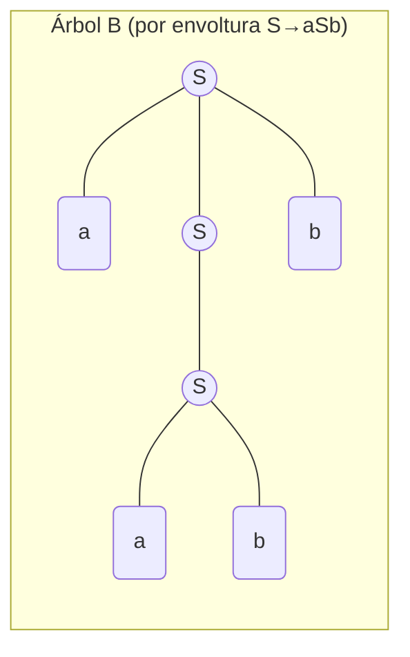

**Sustentación:** el Árbol A parte el problema en dos bloques
independientes `ab`+`ab` desde el primer paso; el Árbol B usa la regla
exterior para meter un bloque `ab` dentro de otro. Dos caminos de
construcción totalmente distintos para la misma cadena → gramática
ambigua.

---

## 14. Operaciones sobre lenguajes

Dado un DFA $M_1$ que reconoce $L_1$ y otro $M_2$ que reconoce $L_2$, se
puede construir un DFA para cada operación:

### 14.1 Unión ($L_1 \cup L_2$)

$$L_1 \cup L_2 = \{w \mid w \in L_1 \text{ o } w \in L_2\}$$

**Construcción:** se arma el **autómata producto** (cada estado nuevo es
un par $(q_{M_1}, q_{M_2})$), y un estado par es final si **al menos
uno** de los dos componentes es final.

### 14.2 Complemento ($\overline{L}$)

$$\overline{L} = \{w \in \Sigma^{*} \mid w \notin L\}$$

**Construcción:** se toma el DFA **completo** (con todas las
transiciones definidas, incluyendo un estado trampa si hace falta) y
simplemente **se invierten** los estados finales y no finales.

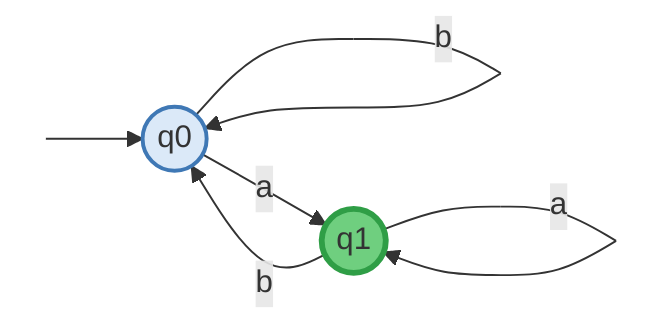

*(automata original — final en verde: q1 = "L")*

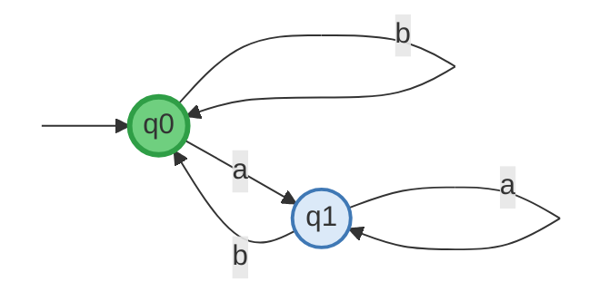

*(mismo automata, pero con los finales invertidos — final en verde: q0
= complemento de L)*

**Importante:** para complementar correctamente, el autómata debe ser
**determinista y completo** (una transición definida para cada símbolo
en cada estado); si no, hay que completarlo primero agregando un estado
trampa.

### 14.3 Intersección ($L_1 \cap L_2$)

$$L_1 \cap L_2 = \{w \mid w \in L_1 \text{ y } w \in L_2\}$$

**Construcción:** igual que la unión (autómata producto), pero un
estado par es final solo si **ambos** componentes son finales a la vez.
*(Dato curioso: por las leyes de De Morgan, también se puede obtener
como $L_1 \cap L_2 = \overline{\overline{L_1} \cup \overline{L_2}}$.)*

### Ejemplo — intersección paso a paso

$L(M)$: acepta cadenas que empiezan con una o más $a$, seguidas de una o
más $b$, y **pueden** terminar con $c$'s.
$L(L)$: acepta cadenas que empiezan con $c$'s, seguidas de una o más
$a$, seguidas de una o más $b$.

```mermaid
graph LR
    s12a(( )):::hidden --> q0((q0))
    q0 -->|a| q1((q1))
    q1 -->|a| q1
    q1 -->|b| q2((q2))
    q2 -->|b| q2
    q2 -->|c| q3((q3))
    q3 -->|c| q3

    classDef hidden fill:#fff,stroke:#fff
    style q0 fill:#dbe9f8,stroke:#3f78b5,stroke-width:2px
    style q1 fill:#dbe9f8,stroke:#3f78b5,stroke-width:2px
    style q2 fill:#6fcf7f,stroke:#2f9e46,stroke-width:3px
    style q3 fill:#6fcf7f,stroke:#2f9e46,stroke-width:3px
```

*(automata $M$: verde = finales q2, q3)*

```mermaid
graph LR
    s12b(( )):::hidden --> p0((p0))
    p0 -->|c| p0
    p0 -->|a| p1((p1))
    p1 -->|a| p1
    p1 -->|b| p2((p2))
    p2 -->|b| p2

    classDef hidden fill:#fff,stroke:#fff
    style p0 fill:#dbe9f8,stroke:#3f78b5,stroke-width:2px
    style p1 fill:#dbe9f8,stroke:#3f78b5,stroke-width:2px
    style p2 fill:#6fcf7f,stroke:#2f9e46,stroke-width:3px
```

*(automata $L$: verde = final p2)*

**Autómata producto (estados $(q,p)$):**

| Estado compuesto | con $a$ | con $b$ | con $c$ | ¿Final? |
|---|---|---|---|---|
| $(q_0,p_0)$ inicial | $(q_1,p_1)$ | ∅ | ∅ | No |
| $(q_1,p_1)$ | $(q_1,p_1)$ | $(q_2,p_2)$ | ∅ | No |
| $(q_2,p_2)$ | ∅ | $(q_2,p_2)$ | ∅ | **Sí** (ambos finales) |

**Conclusión:** $L(M)\cap L(L)$ son las cadenas que **empiezan por una o
más $a$, seguidas de una o más $b$**, sin ningún símbolo $c$ — porque
$L(L)$ no admite $c$'s después de empezar con $a$'s, y $L(M)$ sí las
admite pero no en la posición que $L(L)$ necesita; la única zona donde
ambos coinciden es exactamente $a^{+}b^{+}$.

---

## 15. Autómata de pila (Pushdown Automaton)

Un autómata de pila agrega una **memoria en forma de pila** al DFA — así
puede reconocer lenguajes que un autómata finito no puede, como
$L=\{a^n b^n \mid n\ge 0\}$ (que sí requiere "contar" cuántas $a$'s
hubo).

**Formato de cada regla:** $\delta(q_{actual}, \text{símbolo},
\text{cima de la pila}) = (q_{siguiente}, \text{acción sobre la pila})$

### Reglas para reconocer $a^n b^n$

$$
\begin{aligned}
&\delta(q_0, a, Z) = (q_0, AZ) \\
&\delta(q_0, a, A) = (q_0, AA) \\
&\delta(q_0, b, A) = (q_1, \epsilon) \\
&\delta(q_1, b, A) = (q_1, \epsilon) \\
&\delta(q_1, \epsilon, Z) = (q_2, Z)
\end{aligned}
$$

```mermaid
graph LR
    s13(( )):::hidden --> q0((q0))
    q0 -->|"a, push A"| q0
    q0 -->|"b, pop A"| q1((q1))
    q1 -->|"b, pop A"| q1
    q1 -->|"ε, ver Z"| q2((q2))

    classDef hidden fill:#fff,stroke:#fff
    style q0 fill:#dbe9f8,stroke:#3f78b5,stroke-width:2px
    style q1 fill:#dbe9f8,stroke:#3f78b5,stroke-width:2px
    style q2 fill:#6fcf7f,stroke:#2f9e46,stroke-width:3px
```

*(q0 = fase de meter "a" a la pila; q1 = fase de sacar con "b"; q2,
verde, = final)*

### Trazado con $w=aabb$

| Paso | Símbolo leído | Estado | Pila (tope a la izquierda) |
|---|---|---|---|
| 0 (inicio) | — | $q_0$ | $Z$ |
| 1 | a | $q_0$ | $AZ$ |
| 2 | a | $q_0$ | $AAZ$ |
| 3 | b | $q_1$ | $AZ$ |
| 4 | b | $q_1$ | $Z$ |
| 5 | (fin, $\epsilon$) | $q_2$ | $Z$ |

Se llegó a $q_2$ con la pila reducida solo al fondo $Z$: **la cadena
$aabb$ es aceptada**. La intuición: cada $a$ "guarda un plato" en la
pila, y cada $b$ "quita un plato" — si al final sobran o faltan platos,
la cadena se rechaza.

---

## 16. Máquina de Turing

Una Máquina de Turing agrega, en vez de una pila, una **cinta infinita**
que se puede leer, escribir y recorrer en ambas direcciones. Cada regla
tiene el formato:

$$\delta(q_{actual}, \text{Leer}) = (q_{siguiente}, \text{Escribir}, \text{Movimiento})$$

donde el movimiento solo puede ser **I** (izquierda) o **D** (derecha).

### Ejemplo: detectar el patrón `/*...*/` (comentario de bloque tipo C)

$$
\begin{aligned}
&\delta(q_0,\varnothing)=(q_1,\varnothing,D) &&\delta(q_3,*)=(q_4,*,D)\\
&\delta(q_1,/)=(q_2,/,D) &&\delta(q_4,/)=(q_5,/,D)\\
&\delta(q_2,*)=(q_3,*,D) &&\delta(q_5,B)=(q_6,B,I)\\
&\delta(q_3,C)=(q_3,C,D)
\end{aligned}
$$

**Idea del recorrido:** avanza por la cinta buscando `/`, luego `*`,
luego "come" cualquier contenido de comentario ($C$) hasta encontrar el
cierre `*/`, y al llegar al espacio en blanco final retrocede un paso
para dejar el cabezal justo sobre el último símbolo leído en vez de
quedarse flotando en el vacío.

---

## Lo que quedó fuera (y por qué)

Dos ejercicios del PDF original quedaron intencionalmente fuera de este
documento por ser bocetos a mano con símbolos difíciles de distinguir
con certeza (las reglas $S\to bB, B\to cC,\dots$ de la sección 9, y
parte del autómata racional original de la sección 10). En ambos casos
expliqué el **concepto** con un ejemplo propio equivalente y claro, en
vez de arriesgarme a transcribir mal un trazo ambiguo. Si me pasas una
foto más nítida de esas dos partes, las resuelvo con el mismo nivel de
detalle que el resto.
